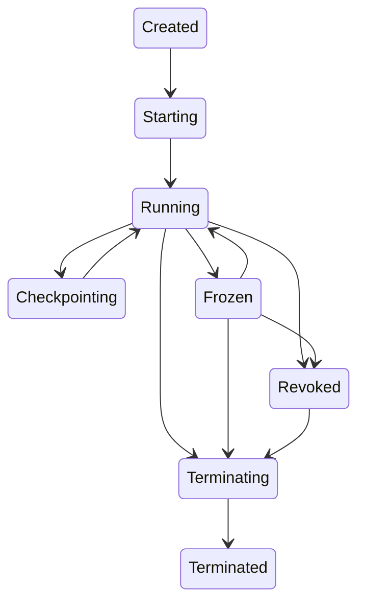

# Web Fabric: Normative Specification (Draft)

**Status:** Draft

## 1. Conformance and terminology
### 1.1 Normative language
The key words **MUST**, **MUST NOT**, **REQUIRED**, **SHALL**, **SHALL NOT**, **SHOULD**, **SHOULD NOT**, **RECOMMENDED**, **MAY**, and **OPTIONAL** are to be interpreted as described in RFC 2119.

### 1.2 Entities
- **Origin**: A web origin as defined by the URL Standard.
- **Node**: A participating browser instance (per browsing context group) executing Web Fabric workloads under user-granted leases.
- **Domain**: A `WebSandboxDomain` instance (micro-VM isolation boundary) running origin-provided code.
- **Capability**: An unforgeable, origin-bound handle granting a specific authority for a bounded lifetime.
- **Lease**: A user-authorized resource contract represented by `WebComputeLease` and related lease capabilities.
- **Service**: A network-facing workload bound to a `fabric://` service identity.
- **IngressQuorum**: A set of nodes holding active ingress capabilities for a service.
- **CID**: A content identifier referencing immutable content by cryptographic hash.
- **ControlPlane**: Consensus-governed metadata and policy coordination.
- **DataPlane**: Bulk transport of requests, tasks, state replication, and content.

### 1.3 Global invariants
User agents implementing Web Fabric MUST uphold:
- **Explicit authorization**: No participation without user-granted leases.
- **Revocability**: All leased authority is time-bounded and revocable.
- **UI priority**: Foreground input and rendering MUST preempt fabric work within a bounded latency.
- **Hard isolation**: Origin workloads run in domains with capability-only I/O.
- **Transparency**: User agents MUST provide auditable per-origin execution and resource receipts.
- **Privacy**: The fabric address space MUST NOT reveal participant IP addresses.

## 2. Security model (overview)
Web Fabric is **zero-trust** by default:
- Any node MAY be malicious.
- Origins MAY be abusive.
- Network paths MAY be adversarial.

Therefore, specifications in sections 6–11 define correctness via determinism, redundancy, BFT consensus (for critical metadata), cryptographic binding of execution, and user-visible receipts.

## 3. Permissions and user experience requirements
### 3.1 Permission classes
User agents MUST gate the following behind explicit user decisions:
- **Compute leasing** (`compute-leasing`)
- **Storage replication** (`fabric-storage`)
- **Ingress hosting** (`fabric-ingress`)
- **Attested execution** (`attested-domains`) when applicable

### 3.2 Revocation UX
User agents MUST provide, per origin:
- A control to **pause**, **throttle**, and **revoke** fabric execution.
- A control to revoke **ingress** separately from compute.
- A receipt view showing **what ran**, **for how long**, and **what resources were consumed**.

## 4. Primitive definitions (normative)
This section defines the required primitives and their semantics.

### 4.1 `WebIdentityToken`
#### 4.1.1 Purpose
`WebIdentityToken` provides an origin-scoped identity for a node suitable for Sybil resistance and protocol authentication without enabling cross-origin tracking.

#### 4.1.2 Properties
A `WebIdentityToken` MUST:
- Be **bound to a single origin**.
- Be **time-limited** and **rotating**.
- Support multiple **attestation tiers**:
  - `software`: no hardware attestation.
  - `hardware-basic`: device key attestation without unique stable identifiers.
  - `hardware-strong`: enclave-backed attestation for domain integrity.
- Include a **privacy budget** to prevent identity probing.

#### 4.1.3 Revocation
User agents MUST be able to invalidate tokens at any time when leases are revoked.

#### 4.1.4 Failure modes
- If attestation cannot be produced, tokens MUST degrade to a lower tier (if permitted) or fail.

### 4.2 `WebPolicyManifest`
#### 4.2.1 Purpose
`WebPolicyManifest` declares the origin’s requested capabilities and operational constraints.

#### 4.2.2 Enforcement
User agents MUST enforce policy at runtime and MUST treat the manifest as declarative intent; it MUST NOT grant authority by itself.

#### 4.2.3 Required fields
A manifest MUST include:
- `bundleHashes`: hashes of task/service bundles.
- `computeLeases`: requested envelopes and QoS profiles.
- `ingressPorts`: service definitions.
- `storageBudget`: replication and space limits.
- `auditMode`: receipt level.
- `verifiabilityLevel`: redundancy/audit/proof requirements.

### 4.3 `WebComputeLease`
#### 4.3.1 Purpose
A compute lease is the unit of user authorization for executing origin workloads.

#### 4.3.2 Contract
A lease MUST specify:
- CPU envelope (`maxCpuPercentBackground`, `maxBurstMs`, `hardPreemptLatencyMs`).
- GPU envelope (via `WebGpuLeaseSlice` if granted).
- Memory envelope (`maxResidentBytes`, `maxCommitBytes`).
- Wakeup budget (`maxWakeupsPerSecond`).
- Network budget (`backgroundEgressKbps`, `backgroundIngressKbps`).
- Power constraints (`onlyWhileCharging`, `minBatteryPercent`, `thermalCeiling`).
- Duration and renewal rules.

#### 4.3.3 Capability semantics
A granted lease MUST yield an unforgeable `leaseCap` capability. All domains spawned under that lease MUST be terminated or frozen when the lease is revoked.

#### 4.3.4 Revocation and sealing
On revocation, the user agent MUST:
- Preempt all fabric execution within `hardPreemptLatencyMs`.
- Provide the domain a bounded **checkpoint window** (if configured).
- If checkpointing fails or exceeds the window, the domain MUST be terminated and any uncommitted state MUST be discarded.

### 4.4 `WebSandboxDomain`
#### 4.4.1 Purpose
A sandbox domain provides a hard isolation boundary for origin workloads.

#### 4.4.2 Isolation requirements
A domain MUST:
- Run in a separate address space.
- Have **no ambient authority**.
- Access I/O only through explicit capabilities.
- Be subject to deterministic or non-deterministic execution mode selection.

#### 4.4.3 Domain images
Domains MUST be created from an origin-signed bundle identified by `imageHash`. User agents MUST verify bundle signatures and hash pinning before execution.

### 4.5 `WebDeterministicVM`
#### 4.5.1 Purpose
`WebDeterministicVM` executes tasks deterministically for verifiability.

#### 4.5.2 Determinism contract
A deterministic execution MUST:
- Use a deterministic time source.
- Use deterministic RNG seeded from declared inputs.
- Disallow direct network I/O.
- Emit a **trace commitment** (hash) and resource usage summary.

#### 4.5.3 Declared oracles
If non-determinism is required, it MUST be expressed as declared oracles whose outputs are committed, logged, and auditable.

### 4.6 `WebKernelBridge`
#### 4.6.1 Purpose
`WebKernelBridge` exposes OS-mediated signals and constrained scheduling hints.

#### 4.6.2 Constraints
`WebKernelBridge` MUST NOT expose arbitrary syscalls or raw device access.

#### 4.6.3 Required signals
User agents SHOULD provide:
- memory pressure level
- thermal trend
- battery discharge trend
- foreground interaction likelihood

### 4.7 `WebIngressPort`
#### 4.7.1 Purpose
`WebIngressPort` provides a browser-managed inbound endpoint for an origin service.

#### 4.7.2 Security properties
Ingress endpoints MUST be:
- authenticated
- rate-limited
- revocable
- sandbox-terminated (traffic delivered only to service domains)
- addressable by service identity (`fabric://svcId`) rather than device IP

#### 4.7.3 Lifetimes
Ingress MUST be time-bounded by TTL and renewed only under active user authorization.

### 4.8 `WebTransportPP`
#### 4.8.1 Purpose
`WebTransportPP` is a multiplexed, migration-capable transport with channel binding to fabric identities.

#### 4.8.2 Requirements
The transport MUST support:
- bidirectional streams
- datagrams
- server push (policy-gated)
- connection migration
- multipath
- cryptographic binding to service identity and node identity tokens

### 4.9 `WebFabricGossip`
#### 4.9.1 Purpose
Membership and metadata propagation.

#### 4.9.2 Requirements
Gossip MUST:
- tolerate churn
- bound overhead
- integrate Sybil resistance via identity tiers and quotas

### 4.10 `WebConsensusGroup`
#### 4.10.1 Purpose
A BFT consensus service for control plane and strong shards.

#### 4.10.2 Requirements
Consensus groups MUST:
- rotate leadership
- support reconfiguration
- emit auditable logs and commitments

### 4.11 `WebCASStore`
#### 4.11.1 Purpose
Content-addressed storage for immutable blobs.

#### 4.11.2 Requirements
CAS MUST:
- chunk data
- use a Merkle DAG
- encrypt at rest
- provide replication/erasure policy

### 4.12 `WebStateShard`
#### 4.12.1 Purpose
Sharded state with selectable consistency.

#### 4.12.2 Modes
`WebStateShard` MUST support:
- strong (BFT)
- bounded-staleness (lease primary)
- eventual (CRDT)

### 4.13 `WebSessionContinuityToken`
#### 4.13.1 Purpose
Session continuity across churn.

#### 4.13.2 Requirements
Tokens MUST:
- be short-lived
- be anti-replay
- reference session state by CID
- be usable for migration without pinning to a single node

### 4.14 `WebGpuLeaseSlice`
#### 4.14.1 Purpose
Bounded, preemptable GPU execution.

#### 4.14.2 Requirements
User agents MUST:
- enforce time slicing
- enforce kernel segmentation
- support watchdog termination

### 4.15 `WebAnchorProvider`
#### 4.15.1 Purpose
Optional anchored persistence via integrity commitments.

#### 4.15.2 Constraints
Anchors MUST NOT store plaintext user data; they store commitments (Merkle roots, manifests) and availability metadata.

## 5. Primitive failure handling (general)
All primitives MUST define and surface:
- permission denial
- lease expiration
- revocation events
- transient unavailability
- integrity/attestation failure

User agents MUST deliver these as structured exceptions and events (see WebIDL section).

## 6. WebIDL APIs (normative)
This section defines the WebIDL-like API surface for Web Fabric.

### 6.1 Design rules
User agents MUST implement the following design rules:
- **Capability objects are opaque**: they MUST NOT expose forgeable identifiers that grant authority.
- **Origin binding**: a capability MUST be usable only from the origin that created it.
- **Revocation**: revoked capabilities MUST fail fast and emit `revoked` events.
- **No ambient authority**: domains receive explicit capability handles only.

### 6.2 Exceptions
```webidl
enum WebFabricErrorCode {
  "NotAllowedError",
  "NotSupportedError",
  "QuotaExceededError",
  "InvalidStateError",
  "IntegrityError",
  "AttestationError",
  "NetworkError",
  "TimeoutError",
  "RevokedError"
};

[Exposed=Window]
interface WebFabricError : DOMException {
  readonly attribute WebFabricErrorCode code;
  readonly attribute any details;
};
```

### 6.3 Identity
```webidl
enum WebIdentityTier {
  "software",
  "hardware-basic",
  "hardware-strong"
};

dictionary WebIdentityRequest {
  required USVString purpose;
  WebIdentityTier minTier = "software";
  DOMHighResTimeStamp ttlMs = 300000;
};

dictionary WebIdentityAttestation {
  WebIdentityTier tier;
  USVString format;
  ArrayBuffer data;
};

[Exposed=Window]
interface WebIdentityToken {
  readonly attribute USVString nodeId;
  readonly attribute WebIdentityTier tier;
  readonly attribute WebIdentityAttestation attestation;
  readonly attribute DOMHighResTimeStamp expiresAt;
};

[Exposed=Window]
interface WebIdentity {
  Promise<WebIdentityToken> request(WebIdentityRequest request);
};

partial interface Navigator {
  readonly attribute WebIdentity webIdentity;
};
```

### 6.4 Leasing and runtime
```webidl
dictionary WebFabricQoSProfile {
  double maxCpuPercentBackground = 10.0;
  DOMHighResTimeStamp maxBurstMs = 10.0;
  DOMHighResTimeStamp hardPreemptLatencyMs = 5.0;

  unsigned long maxWakeupsPerSecond = 30;

  unsigned long long maxResidentBytes = 268435456;
  unsigned long long maxCommitBytes = 536870912;

  unsigned long backgroundEgressKbps = 256;
  unsigned long backgroundIngressKbps = 256;
};

dictionary WebFabricPowerPolicy {
  boolean onlyWhileCharging = false;
  unsigned short minBatteryPercent = 20;
  unsigned short thermalCeiling = 80;
};

dictionary WebComputeLeaseRequest {
  WebFabricQoSProfile qos;
  WebFabricPowerPolicy power;
  DOMHighResTimeStamp durationMs = 900000;
  boolean allowIngress = false;
  boolean allowStorage = false;
  boolean requireAttestedDomains = false;
};

enum WebFabricLeaseState {
  "active",
  "expiring",
  "revoked",
  "expired"
};

[Exposed=Window]
interface WebComputeLease : EventTarget {
  readonly attribute WebFabricLeaseState state;
  readonly attribute DOMHighResTimeStamp expiresAt;
  readonly attribute WebFabricQoSProfile qos;
  readonly attribute WebFabricPowerPolicy power;

  Promise<void> renew(DOMHighResTimeStamp additionalMs);
  Promise<void> revoke();

  attribute EventHandler onstatechange;
  attribute EventHandler onrevoked;
};

dictionary WebSandboxDomainOptions {
  required USVString imageHash;
  required USVString entrypoint;
  boolean deterministic = false;
  USVString environmentName = "default";
};

dictionary WebDomainResourceHints {
  double latencyClass = 0.5;
  double maxJitterMs = 5.0;
  boolean preemptable = true;
};

[Exposed=Window]
interface WebSandboxDomain : EventTarget {
  readonly attribute boolean deterministic;
  readonly attribute USVString domainId;

  Promise<void> setSchedulingHints(WebDomainResourceHints hints);

  Promise<WebDeterministicResult> runDeterministic(WebTaskBundle task,
                                                   WebDeterministicRunOptions options);

  Promise<WebDomainCheckpoint> checkpoint(WebCheckpointOptions options);
  Promise<void> restore(WebDomainCheckpoint checkpoint);
  Promise<void> freeze();
  Promise<void> terminate();

  attribute EventHandler onrevoked;
  attribute EventHandler onterminated;
};

[Exposed=Window]
interface WebLeaseCapability {
  Promise<WebSandboxDomain> spawnDomain(WebSandboxDomainOptions options);
};

dictionary WebLeaseGrant {
  required WebComputeLease lease;
  required WebLeaseCapability leaseCap;
};

dictionary WebClusterJoinOptions {
  WebIdentityToken identity;
  USVString manifestHash;
};

enum WebFabricRole {
  "compute",
  "storage",
  "service",
  "ingress"
};

[Exposed=Window]
interface WebFabricClusterHandle : EventTarget {
  readonly attribute USVString clusterId;
  readonly attribute WebFabricRole[] roles;
  Promise<void> leave();
  attribute EventHandler onrolechange;
  attribute EventHandler onmembershipchange;
};

dictionary WebIngressAuthPolicy {
  USVString scheme;
  USVString audience;
  DOMHighResTimeStamp maxSkewMs = 30000;
};

enum WebFabricProtocol {
  "http3",
  "grpc",
  "datagram",
  "custom"
};

dictionary WebIngressRequest {
  required USVString serviceName;
  required WebFabricProtocol[] protocols;
  WebIngressAuthPolicy auth;
  DOMHighResTimeStamp ttlMs = 300000;
  unsigned long maxConnections = 1000;
  unsigned long maxRps = 1000;
};

[Exposed=Window]
interface WebIngressPort : EventTarget {
  readonly attribute USVString serviceId;
  readonly attribute USVString serviceAddress;
  readonly attribute DOMHighResTimeStamp expiresAt;
  Promise<void> renew(DOMHighResTimeStamp additionalMs);
  Promise<void> revoke();
  attribute EventHandler onrevoked;
};

dictionary WebConsensusGroupOptions {
  unsigned short replicas;
  unsigned short maxFaults;
  USVString rotationPolicy;
};

[Exposed=Window]
interface WebConsensusGroup : EventTarget {
  readonly attribute USVString groupId;
  Promise<ArrayBuffer> propose(ArrayBuffer command);
  Promise<void> reconfigure(WebConsensusGroupOptions options);
};

[Exposed=Window]
interface WebFabricRuntime : EventTarget {
  Promise<WebLeaseGrant> requestLease(WebComputeLeaseRequest request);
  Promise<WebFabricClusterHandle> joinCluster(WebClusterJoinOptions options);
  Promise<WebIngressPort> requestIngress(WebIngressRequest request);
  Promise<WebConsensusGroup> createConsensusGroup(WebConsensusGroupOptions options);
};

partial interface Navigator {
  readonly attribute WebFabricRuntime webFabric;
};
```

### 6.5 Deterministic tasks and results
```webidl
dictionary WebTaskBundle {
  required USVString bundleHash;
  required USVString taskName;
  required USVString inputsCID;
  USVString[] oracleNames = [];
};

dictionary WebDeterministicRunOptions {
  DOMHighResTimeStamp timeBudgetMs = 1000;
  boolean emitTraceCommitment = true;
};

dictionary WebExecutionReceipt {
  USVString origin;
  DOMHighResTimeStamp startedAt;
  DOMHighResTimeStamp finishedAt;
  unsigned long long cpuNanos;
  unsigned long long gpuNanos;
  unsigned long long bytesRead;
  unsigned long long bytesWritten;
  unsigned long long netBytesIn;
  unsigned long long netBytesOut;
};

dictionary WebDeterministicResult {
  required USVString outputCID;
  USVString traceCommitment;
  WebExecutionReceipt receipt;
};
```

### 6.6 Checkpointing
```webidl
dictionary WebCheckpointOptions {
  DOMHighResTimeStamp maxTimeMs = 50;
  boolean allowPartial = true;
};

[Exposed=Window]
interface WebDomainCheckpoint {
  readonly attribute USVString checkpointCID;
  readonly attribute boolean complete;
};
```

### 6.7 Kernel signals
```webidl
dictionary WebKernelSignals {
  unsigned short memoryPressure;
  unsigned short thermalTrend;
  unsigned short batteryTrend;
  unsigned short interactionLikelihood;
};

[Exposed=Window]
interface WebKernelBridge {
  Promise<WebKernelSignals> getSignals();
};

partial interface Navigator {
  readonly attribute WebKernelBridge webKernel;
};
```

### 6.8 Eventing
User agents MUST fire:
- `revoked` on `WebComputeLease`, `WebIngressPort`, and `WebSandboxDomain` when authority is withdrawn.
- `statechange` on leases when transitioning between `active`, `expiring`, `revoked`, `expired`.
- `terminated` on domains when execution ends.

User agents SHOULD include a `WebExecutionReceipt` snapshot in events when available.

## 7. Execution lifecycle and determinism (normative)

### 7.1 Domain classes
User agents MUST support two domain classes:
- **DeterministicDomain**: a `WebSandboxDomain` with `deterministic=true` intended for verifiable compute. It MUST NOT have direct network access.
- **ServiceDomain**: a `WebSandboxDomain` with `deterministic=false` intended to host services. It MUST NOT have ambient network access; inbound traffic MAY be delivered only via `WebIngressPort` and only to ServiceDomains.

Origins MUST declare the intended class of each entrypoint in their `WebPolicyManifest` and task/service bundle metadata.

### 7.2 Bundle integrity and loading
Before executing any origin-provided code in a domain, user agents MUST:
- verify the bundle signature against the origin’s authenticated publishing identity,
- verify the bundle hash matches the manifest’s pinned `bundleHashes`,
- enforce that requested capabilities are a subset of the currently granted lease and policy.

If verification fails, user agents MUST fail with `WebFabricError` code `IntegrityError`.

### 7.3 Domain lifecycle state machine
User agents MUST implement the lifecycle semantics below.



Normative rules:
- **Created**: domain exists but is not scheduled.
- **Starting**: image entrypoint initialization is in progress.
- **Running**: domain is scheduled under lease constraints.
- **Checkpointing**: domain execution is paused while a checkpoint is produced.
- **Frozen**: domain execution is suspended; it MUST consume near-zero CPU and bounded memory.
- **Revoked**: authority has been withdrawn; the domain MUST stop executing immediately.
- **Terminated**: all execution is ended; all capabilities are invalidated.

### 7.4 Deterministic execution contract
For DeterministicDomains, user agents MUST provide a deterministic environment such that:
- the same `WebTaskBundle` + `inputsCID` + oracle outputs yields the same `outputCID`,
- time is represented only by a deterministic virtual time source,
- nondeterminism (timers, host scheduling, hardware queries, floating point variability) is either eliminated or mediated by declared oracles.

User agents MUST ensure that deterministic execution cannot directly access:
- wall-clock time,
- device identifiers,
- network,
- entropy sources not explicitly declared.

### 7.5 Oracle model
An **oracle** is a named, policy-declared source of external data permitted in deterministic tasks (e.g., “random beacon”, “time commitment”, “ledger height commitment”).

Rules:
- Oracles MUST be explicitly listed in `WebTaskBundle.oracleNames`.
- User agents MUST record oracle outputs as part of the execution record.
- If an oracle output is used, it MUST be included in the `traceCommitment` domain when `emitTraceCommitment=true`.
- If an oracle output cannot be obtained within `timeBudgetMs`, the user agent MUST fail with `TimeoutError` unless the origin provided an explicit fallback oracle name.

### 7.6 Checkpointing semantics
User agents MUST support checkpointing as follows:
- A checkpoint MUST serialize sufficient domain state to resume execution.
- A checkpoint MUST be stored as CAS content and referenced by `WebDomainCheckpoint.checkpointCID`.
- If `allowPartial=true`, a checkpoint MAY be incomplete and require deterministic replay from previously committed inputs.
- If checkpointing cannot complete within `WebCheckpointOptions.maxTimeMs` and `allowPartial=false`, the user agent MUST fail the checkpoint request.

### 7.7 Migration and replay
Fabric implementations MUST support churn by migrating work using one or both of:
- **Checkpoint migration**: resume from `checkpointCID`.
- **Deterministic replay**: resume from an earlier checkpoint and replay committed inputs and oracle outputs.

Fabric control planes MUST treat deterministic tasks as idempotent over CIDs:
- if multiple nodes produce the same `outputCID`, results MUST be deduplicated.

### 7.8 Revocation sealing
When a lease is revoked, user agents MUST enforce sealing:
- domains MUST stop executing within `hardPreemptLatencyMs`,
- domains MAY be granted a bounded checkpoint window if local policy allows,
- any state not committed to `WebCASStore`/`WebStateShard` at revocation time MUST be treated as lost,
- domains MUST NOT be able to retain uncommitted secrets across revocation boundaries.

If `auditMode` is `detailed` or stronger, user agents SHOULD be able to snapshot sufficient execution metadata to support dispute resolution (e.g., the deterministic trace commitment and receipts), subject to user privacy controls.

## 8. Scheduling and QoS (normative)

### 8.1 Goal and enforceability requirement
User agents MUST enforce that fabric execution is subordinate to host responsiveness.

The platform MUST provide measurable guarantees:
- **Preemption bound**: fabric work MUST be preempted within `WebFabricQoSProfile.hardPreemptLatencyMs` when user interaction or foreground rendering demands it.
- **Frame safety**: fabric work MUST NOT cause missed frame deadlines beyond a user agent’s baseline jitter budget while a lease is active, except under explicitly disclosed degraded-mode operation.

### 8.2 Execution lanes
User agents MUST schedule fabric execution in OS-grade background lanes with:
- strict CPU caps,
- bounded wakeups,
- memory pressure responsiveness,
- network shaping.

Foreground UI threads MUST always outrank fabric lanes.

### 8.3 DTAPS: Deadline + Thermal-Aware Preemptive Scheduler (reference algorithm)
This specification defines DTAPS as a reference algorithm. Implementations MAY vary, but MUST meet the guarantees in 8.1.

Inputs:
- `vsyncDeadlines`: upcoming frame deadlines.
- `interactionLikelihood`: from `WebKernelSignals`.
- `thermalTrend`, `batteryTrend`, `memoryPressure`: from `WebKernelSignals`.
- `taskUtility`, `taskDeadline`, `checkpointCost`: from the fabric runtime.

Scheduling rules (normative):
- Fabric work MUST run in micro-slices of duration `sliceMs`, where user agents SHOULD choose `sliceMs ∈ [0.5ms, 2ms]`.
- At the end of each slice, fabric work MUST reach a yield point. If it does not, the user agent MUST terminate the offending domain (or revoke its lease) to preserve UI guarantees.
- When `interactionLikelihood` exceeds a UA-defined threshold, fabric utilization MUST be reduced (throttled) before the interaction manifests as jank.
- When `thermalTrend` or `batteryTrend` exceed policy ceilings, fabric MUST shed load and MAY reduce offered lease capacity.

Load shedding policy (normative):
- Implementations MUST prefer shedding tasks with low `taskUtility / checkpointCost`.
- Implementations MUST prefer tasks that can checkpoint quickly when under contention.
- For services, implementations SHOULD degrade quality (tick-rate, fidelity, cache behavior) before refusing new requests.

### 8.4 GPU slicing (`WebGpuLeaseSlice`)
If GPU execution is permitted, user agents MUST enforce:
- time-sliced GPU execution with bounded slice length,
- preemptable kernels (or segmented kernels) such that preemption meets the UI bound,
- a watchdog that terminates GPU work that exceeds granted slice budgets.

User agents SHOULD expose GPU utilization in receipts.

### 8.5 Memory pressure and reclamation
On elevated `memoryPressure`, user agents MUST:
- throttle or pause fabric domains,
- force checkpointing (if permitted),
- reclaim caches (CAS replicas) preferentially.

Domains MUST be terminated if they exceed `maxResidentBytes` or `maxCommitBytes`.

### 8.6 Network shaping
User agents MUST shape background network usage according to the lease’s ingress/egress budgets and MUST prevent starvation of foreground traffic.

### 8.7 Receipts and auto-revocation
User agents MUST maintain per-origin, per-lease receipts and MAY auto-revoke leases that violate UA-enforced QoS invariants (e.g., repeated yield violations, excessive wakeups, or persistent frame deadline misses attributable to fabric work).

## 9. Networking, fabric:// addressing, BCIN, and ingress routing (normative)

### 9.1 Addressing: `fabric://`
Web Fabric defines a service address scheme:
- `fabric://<svcId>`

Where `<svcId>` is an opaque service identifier bound to:
- an origin,
- a `serviceName`,
- a current ingress policy and TTL,
- a cryptographic service identity key.

User agents MUST NOT expose device IPs as part of address resolution.

### 9.2 BCIN: Browser-Coordinated Ingress NAT (rendezvous and relay)
BCIN is a standardized rendezvous system that provides:
- privacy-preserving service resolution,
- authenticated distribution of active ingress endpoints,
- relay fallback when direct paths are unavailable.

BCIN MAY be implemented as a federated set of providers. User agents MUST support multi-provider federation or an equivalent mechanism that avoids a single hard dependency.

### 9.3 Resolution protocol (sketch)
Resolution is performed by the client user agent when connecting to `fabric://<svcId>`.

Request fields:
- `svcId`
- client ephemeral key
- desired protocol set (`http3`, `grpc`, `datagram`, `custom`)
- optional geo/latency hints (coarsened, privacy-budgeted)

Response fields:
- `IngressSet`: list of ingress endpoints (opaque addresses) with public keys
- `Policy`: rate limits, auth requirements, max connection duration
- `Epoch`: short-lived epoch identifier and expiry time
- `Proof`: signature binding `(svcId, IngressSet, Policy, Epoch)` to the service identity

User agents MUST validate `Proof` before using the response.

### 9.4 WebTransportPP handshake (sketch)
WebTransportPP is a multiplexed transport with channel binding.

Handshake goals:
- bind the channel to `svcId` and the service identity,
- optionally bind the client to a privacy-preserving identity token,
- establish stream/datagram keys,
- enable connection migration and multipath.

Required handshake properties:
- forward secrecy
- replay resistance
- explicit protocol negotiation
- proof-of-policy acceptance (client acknowledges `Policy` limits)

### 9.5 Ingress delivery model
Ingress nodes terminate the public-facing channel and deliver requests to ServiceDomains.

Normative constraints:
- Ingress MUST be time-bounded by `WebIngressPort.expiresAt`.
- Ingress MUST enforce `maxConnections`, `maxRps`, and other policy limits.
- Ingress MUST NOT deliver traffic to DeterministicDomains.
- Ingress MUST apply per-origin abuse controls (rate limiting, anomaly detection, automatic revocation).

### 9.6 Routing semantics
Ingress routing MUST support:
- **L4 routing**: datagram/stream forwarding to a selected service instance.
- **L7 routing**: HTTP/3-style request routing with consistent hashing for affinity.

Session affinity:
- If the origin requests affinity, ingress SHOULD use consistent hashing over a stable session key (e.g., `WebSessionContinuityToken` reference) to select a backend ServiceDomain shard.

### 9.7 Multipath and relay fallback
User agents SHOULD attempt direct paths when available and MUST support relay fallback through BCIN-operated relays when direct connectivity is unavailable.

Relays MUST be:
- policy-aware (rate-limited),
- privacy-preserving (no stable identifiers),
- auditable in receipts (bytes relayed).

### 9.8 Revocation and failure
If ingress is revoked:
- existing inbound connections MUST be terminated within a bounded time,
- clients MUST be able to re-resolve and reconnect if a new ingress quorum exists.

If BCIN is unreachable:
- clients MAY use cached `IngressSet` responses until `Epoch` expiry,
- user agents MUST NOT extend cached lifetimes beyond expiry.

### 9.9 Cluster formation and governance (normative)
This subsection specifies how nodes discover each other, maintain membership, and coordinate without a single bottleneck.

#### 9.9.1 Membership and discovery
Fabric nodes MUST join an origin-scoped cluster via BCIN rendezvous and/or cached peer hints.

Requirements:
- Join MUST require a valid `WebIdentityToken`.
- Nodes MUST NOT learn stable, cross-origin identifiers for peers.
- The cluster MUST tolerate churn as a normal condition.

#### 9.9.2 Gossip propagation (`WebFabricGossip`)
Implementations MUST provide a gossip subsystem that disseminates:
- membership views,
- role assignments,
- shard routing tables,
- ingress quorum membership,
- health signals.

Gossip MUST:
- bound overhead per node (e.g., fanout-limited epidemic dissemination),
- converge under churn,
- resist trivial Sybil amplification by incorporating identity tiering and quotas.

Failure detection:
- Implementations SHOULD use a phi-accrual failure detector or equivalent.
- False positives MUST be tolerated (i.e., avoid global halts; prefer reconfiguration).

#### 9.9.3 Control plane: BFT consensus groups (`WebConsensusGroup`)
For critical metadata (e.g., shard ownership, ingress quorums, policy epoch), implementations MUST use BFT consensus groups with:
- explicit membership,
- leader rotation,
- auditable commitments.

Consensus MUST be scoped:
- Small, bounded replica sets for Strong shards and control-plane groups.
- Large-scale membership and data movement MUST remain gossip/data-plane driven.

#### 9.9.4 Leader selection and rotation
Consensus groups MUST rotate leadership on a short epoch (minutes-scale) or on failure.

Leader selection SHOULD be performed using a verifiable random function (VRF) over eligible members and the last committed epoch hash, producing:
- `leaderId`
- `leaderProof`

Clients and nodes MUST verify `leaderProof` before accepting leader-directed control actions.

#### 9.9.5 Reconfiguration
Consensus groups MUST support reconfiguration with:
- adding/removing replicas,
- changing fault parameters within safe bounds,
- emitting a signed configuration commitment.

Reconfiguration MUST be triggered when:
- churn reduces replicas below required quorum,
- performance degradation persists beyond a UA-defined threshold,
- attestation tier changes require reshaping roles.

#### 9.9.6 Bottleneck avoidance
No single node MUST be required for data-plane progress.

Implementations MUST:
- shard state and routing responsibilities,
- allow multiple ingress nodes per service (IngressQuorum),
- avoid routing all traffic through a fixed coordinator,
- use multipath where available.

## 10. Storage, state, and anchored persistence (normative)

### 10.1 WebCASStore: content addressing and encryption
User agents MUST implement CAS as:
- chunked content with cryptographic hash addressing,
- a Merkle DAG for composite objects,
- encrypted-at-rest storage.

Encryption requirements:
- CAS chunks MUST be encrypted with per-origin keys.
- Keys MUST be protected by the user agent and MUST NOT be directly accessible to origin code.

### 10.2 Replication policy
Pinning MUST accept a policy with at least:
- replica count,
- TTL,
- erasure-coding permission.

User agents MAY satisfy replica requirements across multiple devices and SHOULD prefer fault-domain diversity (network/provider/region) when privacy policy permits.

### 10.3 WebStateShard: sharding and consistency modes
State MUST be partitioned into shards. Each shard MUST operate in one of:
- **Strong**: implemented via `WebConsensusGroup` over a bounded replica set.
- **Bounded-staleness**: lease-based primary with replicated followers and bounded divergence.
- **Eventual**: CRDT-based state with monotonic merge.

### 10.4 Transactions and determinism boundaries
For Strong shards:
- writes MUST be serialized through consensus and MUST emit an ordered log commitment.
- reads MUST be linearizable or explicitly labeled as stale.

For Bounded-staleness shards:
- writes MUST be accepted only by the current primary leaseholder and replicated asynchronously.
- reads MUST include a staleness bound in metadata.

For Eventual shards:
- updates MUST be commutative/associative/idempotent CRDT operations.
- merges MUST be deterministic.

### 10.5 Presence-backed persistence
Fabric data may be presence-backed: availability is proportional to participant count.

Implementations MUST expose to origins:
- replica health signals,
- expected availability class (best-effort vs quorum-backed),
without exposing participant identities.

### 10.6 Anchored persistence (`WebAnchorProvider`)
Anchored persistence provides survivability and auditability without storing plaintext user data.

Anchors MUST store only:
- shard manifests (e.g., current shard routing tables),
- Merkle roots / log commitments,
- availability metadata (e.g., “last seen epoch”),
and MUST NOT store plaintext state or CAS content.

Anchors SHOULD support:
- multi-provider federation,
- origin-scoped rate limits,
- verifiable append-only commitments (transparency logs).

## 11. Security and privacy considerations (normative)

### 11.1 Threat model
Implementations MUST assume:
- **Malicious participants**: nodes may lie about results, drop traffic, or attempt to exfiltrate.
- **Sybil attacks**: an attacker may create many low-trust nodes.
- **Abusive origins**: origins may attempt to consume excessive resources.
- **Adversarial networks**: MITM, replay, traffic analysis.
- **Supply-chain attacks**: malicious bundles or dependency substitution.

### 11.2 Capability-based security
User agents MUST enforce:
- no ambient filesystem/network/device access in domains,
- all authority via explicit, revocable capabilities,
- origin binding and time-boundedness for every capability.

### 11.3 Verifiable compute
For deterministic tasks, implementations MUST support at least one of:
- **Redundant execution**: execute tasks on `k` nodes and accept results only if a quorum matches by hash.
- **Replay audits**: randomly sample tasks for deterministic replay by verifiers using trace commitments.

If `verifiabilityLevel` is `proof-required`, implementations MUST require a proof artifact appropriate to the task class (e.g., zk proof), or MUST refuse execution.

### 11.4 Byzantine fault tolerance
For Strong shards and critical control-plane decisions, implementations MUST use BFT consensus with:
- leader rotation,
- reconfiguration,
- auditable commitments anchored or otherwise integrity-protected.

### 11.5 Confidentiality
If origins require confidentiality of inputs:
- inputs MUST be encrypted to a threshold set of attested domains,
- decryption keys MUST be ephemeral and scoped to a task epoch,
- domains MUST not be able to export plaintext outside declared output channels.

### 11.6 Supply-chain integrity
User agents MUST:
- verify bundle signatures,
- enforce hash pinning (`bundleHashes`),
- expose bundle identity and hash in receipts.

User agents SHOULD support reproducible build attestations when provided.

### 11.7 Privacy requirements
User agents MUST:
- rotate identity tokens and prevent stable cross-origin identifiers,
- ensure `fabric://` resolution does not reveal participant IPs to clients,
- enforce privacy budgets on resolution hints (e.g., coarse location).

### 11.8 Transparency and user control
User agents MUST provide per-origin transparency:
- active leases and their envelopes,
- domains running and their bundle hashes,
- ingress endpoints exposed,
- receipts for CPU/GPU/network/storage usage.

User agents MUST allow revocation at any time.

### 11.9 Failure handling and degraded modes (normative)
Fabric operation MUST assume churn and partial failure.

Normative requirements:
- **Churn tolerance**: tasks and services MUST continue operating with frequent node departures/arrivals, subject to quorum constraints.
- **Safety vs liveness**:
  - Strong shards MUST prefer safety; if quorum is lost, writes MUST halt.
  - Bounded-staleness shards MAY continue reads/writes under a primary lease policy; on split-brain risk they MUST degrade to read-only or halt.
  - Eventual shards MUST continue and reconcile on heal.
- **Graceful degradation**: services SHOULD degrade quality before refusing traffic. Degradation MUST be explicit in receipts when it changes externally observable behavior.

Service degradation taxonomy (RECOMMENDED knobs):
- simulation tick rate reductions
- lower fidelity physics/AI
- SSR cache-first and stale-while-revalidate policies
- disable expensive endpoints under load
- reduce replication factor for non-critical CAS pins (within declared bounds)

## 12. Worked example profiles (normative mappings)
This section provides worked examples that map directly onto the primitives in sections 4–11.

### 12.1 Authoritative Minecraft-like server (persistent world)
#### 12.1.1 Roles and primitives used
- **Ingress**: `WebIngressPort`, BCIN resolution, WebTransportPP
- **Authoritative simulation**: `WebSandboxDomain(deterministic=true)` + `runDeterministic()`
- **World state**: Strong `WebStateShard` for tick log + invariants; CAS for deltas/checkpoints
- **Anti-cheat / byzantine tolerance**: redundant execution + trace commitments

#### 12.1.2 Topology
- **IngressQuorum**: 3–9 nodes, rotating under TTL.
- **AuthorityReplicaSet**: 4–7 deterministic replicas (Strong shard governs membership).
- **SessionService**: ServiceDomains for auth, lobbies, matchmaking (bounded-staleness shard).
- **Chat/Presence**: eventual CRDT shard.

#### 12.1.3 Tick pipeline (authoritative)
Per tick \(t\):
1. Clients send inputs to ingress over WebTransportPP datagrams/streams.
2. Ingress routes inputs to SessionService for validation (rate limits, auth).
3. Validated inputs are ordered and committed in the Strong shard as `tickInputsCID(t)`.
4. Each authority replica executes deterministic task:
   - `outputCID = simulateTick(worldStateCID(t-1), tickInputsCID(t))`
   - emits `traceCommitment`
5. Quorum agreement:
   - accept `outputCID` only if a quorum matches by hash
   - commit `tickHash(t)` and `outputCID` pointer into the Strong shard log
6. Publish delta:
   - store `deltaCID(t)` into CAS, pin hot near ingress
   - send state deltas to clients

#### 12.1.4 Failure and churn handling (example timeline)
- **Lease revoked on a replica**:
  - replica MUST stop within `hardPreemptLatencyMs`
  - UA MAY checkpoint within bounded window → publishes `checkpointCID`
  - control plane reconfigures replica set via BFT
  - new replica restores from latest `checkpointCID` and replays tick log
- **Ingress node churn**:
  - clients re-resolve `fabric://svcId` at epoch expiry or on disconnect
  - new ingress quorum forms; old ingress MUST terminate connections on revocation

### 12.2 SSR + API hosting
#### 12.2.1 Roles and primitives used
- **Ingress**: `WebIngressPort` with `http3`/`grpc` protocols
- **Workers**: ServiceDomains (non-deterministic allowed, but capability-scoped)
- **Cache**: CAS pinning near ingress with TTL-based hot replication
- **Session state**: bounded-staleness shard; auth invariants in strong shard

#### 12.2.2 Request flow
1. Client resolves `fabric://svcId` via BCIN.
2. WebTransportPP handshake binds channel to service identity and policy.
3. Ingress performs L7 routing with consistent hashing for affinity.
4. SSR worker renders HTML; assets referenced by CIDs (integrity-checked).
5. Response served; receipts record resource use; cache updated via CAS.

#### 12.2.3 Degraded modes
Under contention:
- prefer cache-first SSR with stale-while-revalidate
- shed expensive endpoints
- reduce render fidelity or disable personalization (policy-declared)

### 12.3 Distributed rendering (tile DAG)
#### 12.3.1 Model
Rendering is expressed as deterministic tasks over asset CIDs.

Pipeline:
- asset ingestion → CAS CIDs
- shader/material compilation → deterministic tasks
- tile render → GPU slice tasks (time-bounded)
- reduction/compositing → deterministic reduce
- publish final artifact CID

Correctness:
- redundancy on sampled tiles
- deterministic composite step for auditability

### 12.4 Compilation pipeline
#### 12.4.1 Model
Build is a DAG of deterministic tasks over content-addressed sources.

Stages:
- source snapshot → CID
- dependency resolution → deterministic task
- compile units → parallel deterministic tasks
- link → deterministic reduce
- tests → deterministic where feasible; otherwise ServiceDomain with declared nondeterminism

Artifacts:
- stored in CAS; reused by hash; pinned by policy

### 12.5 AI inference batching
#### 12.5.1 Model
Inference executes as batch tasks with optional confidentiality.

Primitives:
- model weights pinned in CAS
- GPU execution via time-bounded GPU slices
- outputs published as CIDs with receipts

Confidentiality:
- if requested, inputs encrypted to a threshold set of attested domains
- decryption keys ephemeral to an epoch

Verification:
- spot-check redundancy on sampled batches
- `proof-required` mode permitted for task classes where proofs are feasible

## 13. Vendor implementation requirements (normative)

### 13.1 Browser requirements
User agents implementing Web Fabric MUST provide:

#### 13.1.1 Isolation substrate
- A `WebSandboxDomain` implementation with micro-VM-grade isolation (hardware virtualization where available).
- Capability-only I/O plumbing (no ambient network/filesystem/device access).
- Fast freeze/terminate with bounded latency.

#### 13.1.2 Deterministic execution engine
- A `WebDeterministicVM` environment meeting Section 7 determinism requirements.
- Trace commitment generation and receipt production.
- Oracle mediation and logging.

#### 13.1.3 Lease and QoS enforcement
- OS-integrated scheduling lanes for fabric work.
- Enforced yield points and watchdog termination.
- Memory and wakeup budget enforcement.
- Background network shaping per lease.
- GPU slicing enforcement when GPU execution is enabled.

#### 13.1.4 Ingress stack and service routing
- `WebIngressPort` issuance, renewal, and revocation semantics.
- WebTransportPP implementation (multiplexing, migration, multipath, channel binding).
- L4/L7 routing in ingress, rate limiting, abuse controls, and explicit policy enforcement.

#### 13.1.5 BCIN integration
- Resolution client for `fabric://` with proof validation and epoch caching rules.
- Relay fallback support with receipt accounting.
- Multi-provider federation support or an equivalent anti-dependency design.

#### 13.1.6 Storage engine
- CAS chunking, Merkle DAG support, encryption-at-rest with UA-managed keys.
- Replica placement logic honoring policy and quotas.
- Shard client libraries for Strong/Bounded/Eventual modes.

#### 13.1.7 Transparency UX (non-optional)
User agents MUST expose to users, per origin:
- active leases and envelopes (CPU/GPU/memory/network),
- what domains are running and their bundle hashes,
- whether ingress is enabled and which services are exposed,
- receipts (CPU/GPU/network/storage) and policy-driven degraded modes,
- one-click revoke/pause/throttle controls.

### 13.2 OS requirements
Operating systems that wish to enable the strongest tiers SHOULD provide:

#### 13.2.1 Scheduler support
- Preemptable background execution classes with bounded preemption latency.
- Accounting for wakeups, CPU time, and background fairness suitable for receipts.

#### 13.2.2 GPU preemption
- Time slicing and/or kernel preemption primitives sufficient to enforce `WebGpuLeaseSlice` budgets.
- Driver watchdog integration for termination under UI contention.

#### 13.2.3 Secure identity and attestation
- Hardware-backed attestation primitives for `hardware-basic` and `hardware-strong` tiers.
- Privacy-preserving attestation formats that avoid stable global device identifiers.

#### 13.2.4 Storage and quota enforcement
- Encrypted storage primitives suitable for UA-managed per-origin keys.
- Hard quota enforcement and fast reclamation signals.

#### 13.2.5 Network QoS hooks
- Background traffic shaping with foreground priority.
- Multipath transport support (or hooks enabling UA-level multipath).

### 13.3 Compatibility tiers (RECOMMENDED)
Implementations SHOULD ship in explicit tiers:
- **Tier A (Software-only compute)**: deterministic tasks + receipts; no ingress; limited storage.
- **Tier B (QoS-enforced)**: OS-backed preemption, wakeup/memory enforcement; optional GPU slicing.
- **Tier C (Attested domains)**: hardware-backed identity tiers and stronger sealing/confidentiality.
- **Tier D (Ingress-enabled)**: `WebIngressPort` + BCIN + WebTransportPP; real server semantics.
- **Tier E (Anchored persistence)**: `WebAnchorProvider` support for durable commitments.

User agents MUST clearly label the active tier to users and origins.

### 13.4 Standardization and interoperability notes
For interoperability, vendors SHOULD standardize:
- attestation formats and privacy constraints,
- deterministic VM semantics and trace commitment formats,
- BCIN resolution message formats and proof schemes,
- receipt schema and UX minimums,
- error codes and revocation behaviors.
