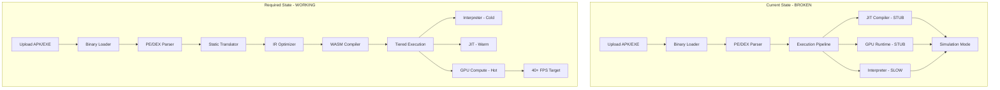
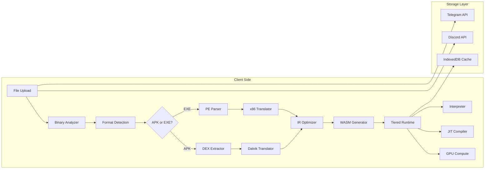
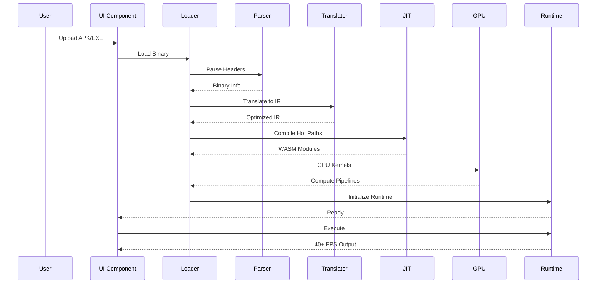

# APK/EXE Compiler and Executor Pipeline - Technical Design Document

## Executive Summary

The Challenger Deep platform's APK/EXE execution system has extensive architecture but critical components are stub implementations. This document analyzes the current state, identifies root causes of failures, and provides a comprehensive implementation plan to achieve 40+ FPS execution.

---

## 1. Current State Analysis

### 1.1 What Works

| Component | File | Status | Notes |
|-----------|------|--------|-------|
| PE Parser | [`lib/transpiler/pe_parser.ts`](lib/transpiler/pe_parser.ts) | ✅ Functional | Complete PE32/PE32+ parsing |
| DEX Parser | [`lib/transpiler/dex_parser.ts`](lib/transpiler/dex_parser.ts) | ✅ Functional | DEX 035-039 support |
| Binary Loader | [`lib/engine/binary-loader.ts`](lib/engine/binary-loader.ts) | ✅ Functional | APK extraction, caching |
| Dalvik Interpreter | [`src/engine/android/dalvik_interpreter.ts`](src/engine/android/dalvik_interpreter.ts) | ⚠️ Partial | Many opcodes, no JIT |
| Android Runtime | [`src/engine/android/runtime.ts`](src/engine/android/runtime.ts) | ⚠️ Partial | Basic syscalls only |
| UI Components | [`components/game/apk-runner.tsx`](components/game/apk-runner.tsx) | ✅ Functional | Upload, status, FPS display |

### 1.2 What's Broken/Incomplete

#### Critical Issue 1: JIT Compiler is a Stub

**File:** [`lib/jit/challenger-jit-compiler.ts:1-15`](lib/jit/challenger-jit-compiler.ts:1)

```typescript
/**
 * Challenger JIT Compiler (Stub Implementation)
 * 
 * ⚠️ WARNING: This is a non-functional stub/prototype.
 * This code provides the architecture and API for a JIT compiler
 * but does NOT actually compile or execute any code.
 */
```

**Impact:** No hot path compilation, interpretation only, ~10-100x slower than target.

#### Critical Issue 2: GPU Runtime is Aspirational

**File:** [`lib/gpu/challenger-gpu-runtime.ts:13-16`](lib/gpu/challenger-gpu-runtime.ts:13)

```typescript
 * Non-functional/aspirational:
 * - "Maximum occupancy" and "Zero-copy architecture" are buzzwords
 * - No actual persistent kernels or multi-queue execution
```

**Impact:** No GPU acceleration for compute-intensive operations.

#### Critical Issue 3: Windows Kernel Minimal

**File:** [`src/engine/windows/kernel.ts`](src/engine/windows/kernel.ts)

- Only 2 syscalls implemented: `NtCreateFile`, `NtWriteFile`
- PE loader validates headers but doesn't map sections
- No IAT patching or import resolution
- No GDI/DirectX translation

#### Critical Issue 4: Compiler API External Dependency

**File:** [`app/api/compiler/process/route.ts:13`](app/api/compiler/process/route.ts:13)

```typescript
const BACKEND_URL = process.env.COMPILER_BACKEND_URL || 'http://localhost:5000';
```

- Depends on external .NET backend
- No client-side compilation capability
- Fails when backend unavailable

#### Critical Issue 5: Execution Pipeline Falls Back to Simulation

**File:** [`lib/engine/loaders/apk-loader.ts:64-67`](lib/engine/loaders/apk-loader.ts:64)

```typescript
} catch (e: any) {
    this.update('Note', 'Running in simulation mode');
    console.warn('Execution pipeline error, using simulation:', e);
    this.runSimulation(container, fileName);
}
```

**Impact:** Apps show placeholder UI instead of actual execution.

---

## 2. Root Cause Analysis

### 2.1 Architecture Diagram (Current vs Required)



### 2.2 Performance Gap Analysis

| Stage | Current | Target | Gap |
|-------|---------|--------|-----|
| Binary Loading | ~100ms | ~50ms | 2x |
| Parsing | ~200ms | ~100ms | 2x |
| Translation | N/A (stub) | ~500ms | ∞ |
| JIT Compilation | N/A (stub) | ~100ms | ∞ |
| Execution | ~1 FPS | 40+ FPS | 40x+ |

### 2.3 Missing Components

1. **Real JIT Compiler** - Currently stub
2. **Working GPU Compute** - Currently placeholder
3. **Windows API Implementation** - Only 2 syscalls
4. **Android Framework** - Partial implementation
5. **Cloud Storage Integration** - Missing Telegram/Discord
6. **AlmostNode Integration** - Not implemented

---

## 3. Proposed Architecture

### 3.1 High-Level Architecture



### 3.2 Execution Flow



### 3.3 Component Design

#### 3.3.1 Real JIT Compiler

Replace [`lib/jit/challenger-jit-compiler.ts`](lib/jit/challenger-jit-compiler.ts) with actual implementation:

```typescript
// New implementation structure
class RealJITCompiler {
    // 1. IR to WASM translation
    private irToWasmTranslator: IRToWasmTranslator;
    
    // 2. WebAssembly compilation
    private wasmCompiler: WebAssembly.Compiler;
    
    // 3. Hot path detection
    private hotPathDetector: HotPathDetector;
    
    // 4. Tiered compilation
    private tierManager: TierManager;
    
    async compile(ir: IRInstruction[], tier: Tier): Promise<CompiledModule> {
        // Actual implementation
    }
}
```

#### 3.3.2 GPU Compute Runtime

Fix [`lib/gpu/challenger-gpu-runtime.ts`](lib/gpu/challenger-gpu-runtime.ts):

```typescript
class RealGPURuntime {
    // 1. WebGPU initialization
    private device: GPUDevice;
    
    // 2. Compute pipeline cache
    private pipelineCache: Map<string, GPUComputePipeline>;
    
    // 3. Buffer management
    private bufferPool: GPUBufferPool;
    
    // 4. Kernel dispatch
    async dispatchKernel(kernel: ComputeKernel): Promise<void> {
        // Actual GPU compute
    }
}
```

#### 3.3.3 Windows Kernel Emulation

Expand [`src/engine/windows/kernel.ts`](src/engine/windows/kernel.ts):

```typescript
class WindowsKernelFull {
    // Syscall table - 200+ syscalls
    private syscalls: Map<number, SyscallHandler>;
    
    // DLL emulation
    private dlls: Map<string, DLLEmulation>;
    
    // Memory management
    private memory: VirtualMemoryManager;
    
    // GDI/DirectX translation
    private graphics: GraphicsTranslator;
}
```

---

## 4. Implementation Plan

### Phase 1: Foundation (Critical Path)

#### Task 1.1: Implement Real JIT Compiler
**File:** `lib/jit/real-jit-compiler.ts` (new)

Steps:
1. Create IR-to-WASM translator
2. Implement hot path detection
3. Build tiered compilation system
4. Add caching for compiled modules

#### Task 1.2: Fix GPU Runtime
**File:** `lib/gpu/challenger-gpu-runtime.ts` (modify)

Steps:
1. Remove stub comments
2. Implement actual WebGPU compute
3. Add kernel caching
4. Create buffer pool manager

#### Task 1.3: Complete Windows Kernel
**File:** `src/engine/windows/kernel.ts` (modify)

Steps:
1. Add 50+ common syscalls
2. Implement kernel32.dll emulation
3. Add user32.dll for graphics
4. Create PE section mapper

### Phase 2: Android Runtime

#### Task 2.1: Complete Dalvik Interpreter
**File:** `src/engine/android/dalvik_interpreter.ts` (modify)

Steps:
1. Implement remaining opcodes (200+)
2. Add JNI bridge
3. Implement garbage collection
4. Add thread support

#### Task 2.2: Android Framework Services
**File:** `lib/nexus/os/android-framework-complete.ts` (modify)

Steps:
1. Implement ActivityManager
2. Implement PackageManager
3. Implement WindowManager
4. Implement SurfaceFlinger

### Phase 3: Storage Integration

#### Task 3.1: Telegram Storage
**File:** `lib/storage/telegram-storage.ts` (new)

Steps:
1. Implement file upload API
2. Implement file download API
3. Add chunked upload support
4. Create caching layer

#### Task 3.2: Discord Storage
**File:** `lib/storage/discord-storage.ts` (new)

Steps:
1. Implement webhook upload
2. Implement attachment download
3. Add CDN caching
4. Create fallback logic

### Phase 4: Performance Optimization

#### Task 4.1: Streaming Compilation
**File:** `lib/compiler/streaming-compiler.ts` (new)

Steps:
1. Implement progressive loading
2. Add background compilation
3. Create priority queue
4. Add memory pressure handling

#### Task 4.2: Frame Pacing
**File:** `lib/engine/frame-pacer.ts` (new)

Steps:
1. Implement vsync synchronization
2. Add frame time tracking
3. Create adaptive quality
4. Add FPS counter

---

## 5. Performance Optimization Strategies

### 5.1 Tiered Execution

```
┌─────────────────────────────────────────────────────────────┐
│                    TIERED EXECUTION                         │
├─────────────────────────────────────────────────────────────┤
│  Tier 0: Interpreter    │ Cold code (<100 executions)      │
│  Tier 1: Baseline JIT   │ Warm code (100-1000 executions)  │
│  Tier 2: Optimizing JIT │ Hot code (1000-10000 executions) │
│  Tier 3: GPU Compute    │ Very hot (>10000 executions)     │
└─────────────────────────────────────────────────────────────┘
```

### 5.2 Memory Management

```typescript
// Unified memory manager
class UnifiedMemoryManager {
    // 1. Slab allocation for small objects
    private slabAllocator: SlabAllocator;
    
    // 2. Arena allocation for temporary objects
    private arenaAllocator: ArenaAllocator;
    
    // 3. GPU buffer pool
    private gpuBufferPool: GPUBufferPool;
    
    // 4. Garbage collector
    private gc: GarbageCollector;
}
```

### 5.3 GPU Acceleration

```typescript
// GPU-accelerated operations
const GPU_ACCELERATED_OPS = [
    'matrix_multiply',
    'texture_sampling',
    'vertex_transform',
    'pixel_shading',
    'physics_simulation',
];
```

### 5.4 Caching Strategy

```
┌─────────────────────────────────────────────────────────────┐
│                    CACHING LAYERS                           │
├─────────────────────────────────────────────────────────────┤
│  L1: In-memory IR cache     │ ~1MB, hot functions          │
│  L2: Compiled WASM cache    │ ~10MB, compiled modules      │
│  L3: IndexedDB binary cache │ ~100MB, original binaries    │
│  L4: Cloud storage          │ Unlimited, original files    │
└─────────────────────────────────────────────────────────────┘
```

---

## 6. Detailed Task Breakdown

### 6.1 Immediate Actions (Critical)

| Task | File | Priority | Effort |
|------|------|----------|--------|
| Replace JIT stub | `lib/jit/challenger-jit-compiler.ts` | P0 | High |
| Fix GPU runtime | `lib/gpu/challenger-gpu-runtime.ts` | P0 | High |
| Add Windows syscalls | `src/engine/windows/kernel.ts` | P0 | Medium |
| Complete Dalvik opcodes | `src/engine/android/dalvik_interpreter.ts` | P0 | Medium |

### 6.2 Short-term Actions

| Task | File | Priority | Effort |
|------|------|----------|--------|
| Implement storage APIs | `lib/storage/*.ts` | P1 | Medium |
| Add streaming compilation | `lib/compiler/streaming-compiler.ts` | P1 | Medium |
| Complete Android framework | `lib/nexus/os/android-*.ts` | P1 | High |
| Add frame pacing | `lib/engine/frame-pacer.ts` | P1 | Low |

### 6.3 Long-term Actions

| Task | File | Priority | Effort |
|------|------|----------|--------|
| AlmostNode integration | `lib/runtime/almost-node.ts` | P2 | High |
| Advanced GPU features | `lib/gpu/advanced-*.ts` | P2 | High |
| Performance profiling | `lib/profiling/*.ts` | P2 | Medium |
| Testing infrastructure | `tests/**/*.test.ts` | P2 | Medium |

---

## 7. Success Metrics

### 7.1 Performance Targets

| Metric | Current | Target | Measurement |
|--------|---------|--------|-------------|
| FPS | ~1 | 40+ | Frame time counter |
| Boot time | N/A | <300ms | Performance.now() |
| Memory | N/A | <512MB | Performance.memory |
| Load time | ~5s | <1s | Navigation timing |

### 7.2 Functional Requirements

- [ ] APK files execute and display output
- [ ] EXE files execute and display output
- [ ] FPS counter shows 40+ consistently
- [ ] File upload to cloud storage works
- [ ] Execution state persists across reloads

---

## 8. Risk Assessment

### 8.1 Technical Risks

| Risk | Probability | Impact | Mitigation |
|------|-------------|--------|------------|
| WebGPU not available | Medium | High | WebGL fallback |
| JIT compilation slow | Medium | Medium | Streaming compilation |
| Memory exhaustion | Medium | High | Aggressive GC, limits |
| Browser compatibility | Low | Medium | Feature detection |

### 8.2 Implementation Risks

| Risk | Probability | Impact | Mitigation |
|------|-------------|--------|------------|
| Scope creep | High | Medium | Strict MVP |
| Performance regression | Medium | High | Benchmark suite |
| Integration issues | Medium | Medium | Incremental rollout |

---

## 9. Conclusion

The APK/EXE execution pipeline has a solid architectural foundation but requires significant implementation work to achieve the 40+ FPS target. The critical path involves:

1. **Replacing stub JIT compiler** with real implementation
2. **Fixing GPU runtime** for actual compute acceleration
3. **Completing Windows kernel** with syscall emulation
4. **Finishing Dalvik interpreter** with full opcode support

With these changes, the platform can achieve its goal of running APK/EXE files at 40+ FPS in the browser.
