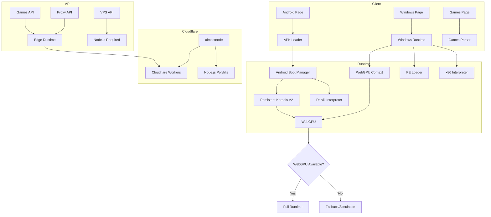

# Fix Plan: APK/EXE Runner, UI Bugs, and Cloudflare Proxy

## Executive Summary

This document outlines the plan to fix three main issues in the Challenger Deep application:
1. **APK/EXE app running doesn't work** - Runtime initialization failures
2. **UI bugs** - Various user interface issues
3. **Cloudflare proxy doesn't work** - Edge runtime compatibility issues

## Root Cause Analysis

### 1. Cloudflare Proxy Issues

**Problem**: The application uses `@cloudflare/next-on-pages` to deploy to Cloudflare Pages, but several API routes and server-side code require Node.js runtime which is not available in Cloudflare Workers.

**Key Issues Identified**:
- [`lib/server/firebase-admin.ts`](lib/server/firebase-admin.ts:1) uses `server-only` directive and Firebase Admin SDK (Node.js only)
- [`lib/server/security.ts`](lib/server/security.ts:1) uses `server-only` directive
- API routes like [`app/api/vps/rendezvous/register/route.ts`](app/api/vps/rendezvous/register/route.ts:1) import from these Node.js-only modules
- The webpack config in [`next.config.js`](next.config.js:227) attempts to replace Node.js modules but doesn't handle all cases

**Solution**: Integrate `almostnode` (https://github.com/macaly/almostnode) to enable Node.js compatibility on Cloudflare Pages.

### 2. Android APK Runner Issues

**Problem**: The APK runner fails to initialize due to a complex dependency chain and WebGPU requirements.

**Code Flow**:
```
app/android/page.tsx
  → lib/engine/loaders/apk-loader.ts
    → lib/nexus/os/android-boot.ts
      → lib/nexus/gpu/persistent-kernels-v2.ts (WebGPU required)
      → lib/hle/dalvik-interpreter-full.ts
      → lib/jit/gpu-parallel-compiler.ts
      → lib/execution/gpu-logic-executor.ts
```

**Key Issues Identified**:
- WebGPU initialization in [`lib/nexus/gpu/persistent-kernels-v2.ts:71`](lib/nexus/gpu/persistent-kernels-v2.ts:71) throws if not supported
- No fallback for browsers without WebGPU support
- Complex interdependencies between modules can cause cascading failures
- Missing error boundaries in the UI

### 3. Windows EXE Runner Issues

**Problem**: Similar to Android, the Windows runner has initialization issues.

**Code Flow**:
```
app/windows/page.tsx
  → lib/nacho/gpu/webgpu.ts (WebGPU required)
  → lib/nacho/windows/runtime.ts
    → lib/nacho/memory/unified-memory.ts
    → lib/nacho/core/interpreter.ts
    → lib/nacho/windows/pe-loader.ts
```

**Key Issues Identified**:
- WebGPU initialization in [`lib/nacho/gpu/webgpu.ts:14`](lib/nacho/gpu/webgpu.ts:14) throws if not supported
- The runtime has a fallback to Canvas 2D but it's incomplete
- PE loader may not handle all executable formats

### 4. UI Bugs

**Potential Issues**:
- Missing loading states during async operations
- Error handling could be improved
- The games page virtualization may have scroll issues

---

## Detailed Fix Plan

### Phase 1: Cloudflare/Node.js Compatibility

#### Step 1.1: Integrate almostnode
- Add almostnode as a dependency
- Configure it for Cloudflare Pages compatibility
- This enables Node.js APIs to work in Cloudflare Workers

#### Step 1.2: Update API Routes
- Review all API routes using `export const runtime = 'edge'`
- Ensure they work with the almostnode polyfills
- Update [`lib/server/firebase-admin.ts`](lib/server/firebase-admin.ts:1) to use conditional imports

#### Step 1.3: Update Build Configuration
- Modify [`scripts/build-cloudflare-debug.js`](scripts/build-cloudflare-debug.js:1) to include almostnode
- Update [`next-on-pages.config.js`](next-on-pages.config.js:1) if needed

### Phase 2: Android APK Runner Fixes

#### Step 2.1: Add WebGPU Feature Detection
- Update [`lib/engine/loaders/apk-loader.ts`](lib/engine/loaders/apk-loader.ts:1) to check for WebGPU before attempting to boot
- Add a user-friendly error message when WebGPU is unavailable
- Provide a fallback mode or simulation

#### Step 2.2: Improve Error Handling
- Wrap initialization in try-catch with detailed error messages
- Add timeout handling for slow WebGPU initialization
- Implement graceful degradation

#### Step 2.3: Fix Dependency Chain
- Review [`lib/nexus/os/android-boot.ts`](lib/nexus/os/android-boot.ts:1) for missing imports
- Ensure all required modules are properly exported
- Add lazy loading for heavy dependencies

### Phase 3: Windows EXE Runner Fixes

#### Step 3.1: Add WebGPU Feature Detection
- Similar to Android, add proper feature detection in [`app/windows/page.tsx`](app/windows/page.tsx:1)
- Improve the Canvas 2D fallback in [`lib/nacho/gpu/webgpu.ts`](lib/nacho/gpu/webgpu.ts:1)

#### Step 3.2: Improve Runtime Initialization
- Add better error handling in [`lib/nacho/windows/runtime.ts`](lib/nacho/windows/runtime.ts:1)
- Ensure the PE loader handles edge cases

### Phase 4: UI Bug Fixes

#### Step 4.1: Games Page
- Review virtualization implementation in [`app/games/page.tsx`](app/games/page.tsx:1)
- Fix any scroll or loading issues

#### Step 4.2: Error States
- Add consistent error boundaries
- Improve error messages

---

## Architecture Diagram



---

## Implementation Order

1. **Cloudflare/almostnode integration** - Foundation for other fixes
2. **WebGPU feature detection** - Prevents crashes on unsupported browsers
3. **Error handling improvements** - Better user experience
4. **UI bug fixes** - Polish and refinement

---

## Files to Modify

### Cloudflare Fixes
- `package.json` - Add almostnode dependency
- `scripts/build-cloudflare-debug.js` - Update build process
- `lib/server/firebase-admin.ts` - Conditional imports
- `lib/server/security.ts` - Edge-compatible rate limiting
- `app/api/vps/rendezvous/*/route.ts` - Update imports

### Android Runner Fixes
- `lib/engine/loaders/apk-loader.ts` - Add WebGPU detection
- `lib/nexus/os/android-boot.ts` - Improve error handling
- `lib/nexus/gpu/persistent-kernels-v2.ts` - Add fallback
- `app/android/page.tsx` - Better error UI

### Windows Runner Fixes
- `lib/nacho/gpu/webgpu.ts` - Improve fallback
- `lib/nacho/windows/runtime.ts` - Better error handling
- `app/windows/page.tsx` - Better error UI

### UI Fixes
- `app/games/page.tsx` - Fix virtualization issues
- Various components - Add error boundaries

---

## Testing Strategy

1. **Local Testing**
   - Test with `pnpm dev` for development
   - Test with `CF_PAGES=1 pnpm build:cloudflare` for production build

2. **Browser Testing**
   - Test on Chrome (WebGPU supported)
   - Test on Firefox (WebGPU may not be supported)
   - Test on Safari (WebGPU may not be supported)

3. **Cloudflare Testing**
   - Deploy to Cloudflare Pages preview
   - Test all API routes
   - Test proxy functionality

---

## Success Criteria

- [ ] APK files can be loaded and run on WebGPU-capable browsers
- [ ] EXE files can be loaded and run on WebGPU-capable browsers
- [ ] Graceful fallback/error on non-WebGPU browsers
- [ ] All API routes work on Cloudflare Pages
- [ ] Games library loads and displays correctly
- [ ] No console errors during normal operation
