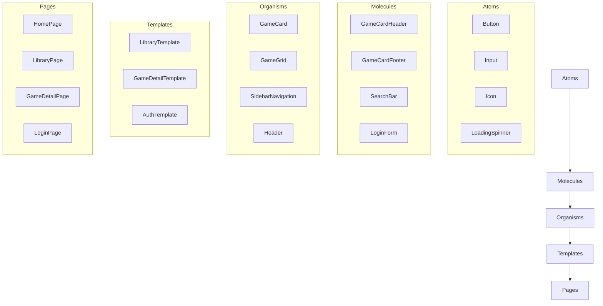

# Frontend Architecture Design for Gaming Platform

## 1. Project Overview

This document outlines the frontend architecture for a modern gaming platform with features comparable to GeForce NOW or Steam. The platform supports HTML5 games, APK applications, and EXE files through web-based runtime environments.

### Key Requirements:
- Modern UI with smooth GSAP animations
- 3D visual effects using Three.js
- Complete authentication system
- Game library interface with custom URL structure
- Support for running APK and EXE applications
- Performance-optimized code with clean architecture
- End-to-end integration between frontend, backend, and runtime components

## 2. Folder Structure & File Organization

```
/app
├── layout.tsx                 # Root layout with metadata and providers
├── page.tsx                   # Home page with hero and featured games
├── globals.css                # Global styles and Tailwind imports
├── loading.tsx                # Loading skeleton
├── error.tsx                  # Error boundary
├── (auth)
│   ├── login
│   │   └── page.tsx          # Login page
│   ├── signup
│   │   └── page.tsx          # Signup page
│   ├── verify
│   │   └── page.tsx          # Email verification
│   └── layout.tsx            # Auth layout (minimal)
├── (dashboard)
│   ├── library
│   │   ├── page.tsx         # Game library main page
│   │   ├── [gameId]
│   │   │   └── page.tsx     # Game detail page
│   │   └── [gameId]
│   │       └── play
│   │           └── page.tsx # Game play route
│   ├── settings
│   │   ├── page.tsx         # Settings page
│   │   └── account
│   │       └── page.tsx     # Account settings
│   ├── profile
│   │   └── page.tsx         # User profile
│   └── layout.tsx           # Dashboard layout with sidebar
├── api
│   └── ...                   # API routes (existing)
└── [locale]                  # i18n support

/components
├── ui                        # Reusable UI components
│   ├── button.tsx
│   ├── card.tsx
│   ├── modal.tsx
│   ├── input.tsx
│   ├── select.tsx
│   └── ...
├── layout
│   ├── header.tsx           # Navigation header
│   ├── sidebar.tsx          # Dashboard sidebar
│   ├── footer.tsx
│   └── container.tsx
├── game
│   ├── game-card.tsx        # Game card component
│   ├── game-grid.tsx        # Game grid layout
│   ├── game-details.tsx     # Game detail view
│   └── game-player.tsx      # Game player/iframe wrapper
├── animations
│   ├── hero-animations.tsx  # Hero section animations
│   ├── card-animations.tsx  # Card hover effects
│   └── page-transitions.tsx # Route transitions
├── 3d
│   ├── background-scene.tsx # 3D background
│   ├── game-icon.tsx        # 3D game icons
│   └── effects.tsx          # Particle effects
└── providers
    ├── auth-provider.tsx    # Authentication context
    ├── theme-provider.tsx   # Theme context
    └── game-provider.tsx    # Game data context

/hooks
├── useAuth.ts              # Authentication hook
├── useGame.ts              # Game data fetching hook
├── useAnimation.ts         # GSAP animation hook
├── use3D.ts                # Three.js scene hook
└── useToast.ts             # Notification hook

/lib
├── utils.ts                # Utility functions
├── api
│   ├── auth.ts             # Auth API calls
│   ├── games.ts            # Games API calls
│   └── users.ts            # User API calls
├── constants
│   ├── routes.ts           # Route definitions
│   ├── endpoints.ts        # API endpoints
│   └── config.ts           # Configuration
├── validators
│   ├── auth.ts             # Auth form validation
│   └── games.ts            # Game data validation
└── types
    ├── auth.ts             # Auth types
    ├── games.ts            # Game types
    └── users.ts            # User types

/public
├── fonts
├── images
├── videos
└── wasm                    # WebAssembly files

/styles
├── theme.css               # Theme variables
├── animations.css          # CSS animations
└── responsive.css          # Responsive styles

```

## 3. Component Architecture

### 3.1 Atomic Design Approach



### 3.2 Key Components

#### Game Library Components
- **GameCard**: Displays game thumbnail, title, rating, and play button with hover animations
- **GameGrid**: Responsive grid layout for displaying game cards
- **GameDetails**: Detailed view with description, screenshots, system requirements
- **GamePlayer**: Wrapper for HTML5 game iframe with communication layer

#### Navigation Components
- **Header**: Top navigation with search, user menu, and notifications
- **Sidebar**: Dashboard navigation with library, settings, profile links
- **Breadcrumb**: Path navigation for nested routes

#### Interactive Components
- **AnimatedBackground**: Three.js 3D background with parallax effects
- **ParticleEffects**: GSAP particle animations for loading and transitions
- **Modal**: Reusable modal for authentication, settings, and game info

## 4. State Management

### 4.1 Context API for Global State

```typescript
// lib/context/auth-context.tsx
interface AuthContextType {
  user: User | null;
  isLoading: boolean;
  login: (credentials: LoginCredentials) => Promise<User>;
  signup: (credentials: SignupCredentials) => Promise<User>;
  logout: () => Promise<void>;
}

// lib/context/game-context.tsx
interface GameContextType {
  games: Game[];
  featuredGames: Game[];
  recentlyPlayed: Game[];
  isLoading: boolean;
  fetchGames: (filters?: GameFilters) => Promise<Game[]>;
  fetchGameDetails: (gameId: string) => Promise<GameDetails>;
  playGame: (gameId: string) => Promise<GameSession>;
}

// lib/context/theme-context.tsx
interface ThemeContextType {
  theme: 'light' | 'dark' | 'auto';
  toggleTheme: () => void;
}
```

### 4.2 Data Fetching & Caching

```typescript
// hooks/useGame.ts
export const useGame = () => {
  const { games, isLoading, fetchGames } = useContext(GameContext);
  
  const fetchAndCacheGames = async (filters?: GameFilters) => {
    const cachedGames = localStorage.getItem('games');
    if (cachedGames && !filters) {
      return JSON.parse(cachedGames);
    }
    
    const freshGames = await fetchGames(filters);
    localStorage.setItem('games', JSON.stringify(freshGames));
    return freshGames;
  };
  
  return { games, isLoading, fetchAndCacheGames };
};
```

## 5. Routing Strategy

### 5.1 URL Structure

```typescript
// lib/constants/routes.ts
export const ROUTES = {
  HOME: '/',
  LOGIN: '/login',
  SIGNUP: '/signup',
  VERIFY: '/verify',
  LIBRARY: '/library',
  GAME_DETAILS: '/library/[gameId]',
  GAME_PLAY: '/library/[gameId]/play',
  PROFILE: '/profile',
  SETTINGS: '/settings',
  ACCOUNT_SETTINGS: '/settings/account',
} as const;
```

### 5.2 Dynamic Routes with Next.js App Router

```typescript
// app/(dashboard)/library/[gameId]/page.tsx
interface GameDetailPageProps {
  params: { gameId: string };
}

export default async function GameDetailPage({ params }: GameDetailPageProps) {
  const game = await getGameDetails(params.gameId);
  
  return <GameDetails game={game} />;
}
```

### 5.3 Game URL Integration

```typescript
// lib/api/games.ts
export const getGameUrl = (gameId: string): string => {
  return `https://html5.gamedistribution.com/rvvASMiM/${gameId}/`;
};

// components/game/game-player.tsx
export const GamePlayer = ({ gameId }: { gameId: string }) => {
  const gameUrl = getGameUrl(gameId);
  
  return (
    <iframe
      src={gameUrl}
      title="Game Player"
      className="w-full h-full border-0"
      sandbox="allow-scripts allow-same-origin allow-pointer-lock"
    />
  );
};
```

## 6. Performance Optimization Techniques

### 6.1 Code Splitting & Lazy Loading

```typescript
// components/game/game-player.tsx
import dynamic from 'next/dynamic';

const GamePlayer = dynamic(() => import('./game-player'), {
  loading: () => <GameLoadingPlaceholder />,
  ssr: false,
});

// components/3d/background-scene.tsx
const BackgroundScene = dynamic(() => import('./background-scene'), {
  loading: () => <div className="bg-gradient-to-br from-blue-900 to-purple-900" />,
  ssr: false,
});
```

### 6.2 Image Optimization

```typescript
// components/game/game-card.tsx
import Image from 'next/image';

export const GameCard = ({ game }: { game: Game }) => {
  return (
    <div className="game-card">
      <Image
        src={game.thumbnail}
        alt={game.title}
        width={300}
        height={200}
        loading="lazy"
        placeholder="blur"
        blurDataURL={game.thumbnailBlur}
        className="rounded-lg"
      />
      {/* Card content */}
    </div>
  );
};
```

### 6.3 GSAP Animation Performance

```typescript
// hooks/useAnimation.ts
import gsap from 'gsap';
import { useRef, useEffect } from 'react';

export const useAnimation = (config: gsap.TweenVars = {}) => {
  const elementRef = useRef<HTMLDivElement>(null);
  
  useEffect(() => {
    const element = elementRef.current;
    if (!element) return;
    
    gsap.fromTo(
      element,
      { opacity: 0, y: 20 },
      {
        opacity: 1,
        y: 0,
        duration: 0.6,
        ease: 'power3.out',
        ...config,
      }
    );
  }, [config]);
  
  return elementRef;
};
```

### 6.4 Three.js Performance

```typescript
// components/3d/background-scene.tsx
import { Canvas, useFrame } from '@react-three/fiber';
import { OrbitControls, Stats } from '@react-three/drei';

const Scene = () => {
  const meshRef = useRef<Mesh>(null);
  
  useFrame((state, delta) => {
    if (meshRef.current) {
      meshRef.current.rotation.x += delta * 0.1;
      meshRef.current.rotation.y += delta * 0.15;
    }
  });
  
  return (
    <mesh ref={meshRef}>
      <boxGeometry args={[2, 2, 2]} />
      <meshStandardMaterial color="#00ff88" />
    </mesh>
  );
};

export const BackgroundScene = () => {
  return (
    <Canvas dpr={[1, 2]} camera={{ position: [0, 0, 5], fov: 50 }}>
      <ambientLight intensity={0.5} />
      <pointLight position={[10, 10, 10]} />
      <Scene />
      <OrbitControls enableZoom={false} />
      <Stats />
    </Canvas>
  );
};
```

## 7. Integration Points

### 7.1 Backend API Integration

```typescript
// lib/api/auth.ts
import axios from 'axios';

const API_BASE = process.env.NEXT_PUBLIC_API_BASE || '/api';

export const authAPI = {
  login: async (credentials: LoginCredentials) => {
    const response = await axios.post(`${API_BASE}/auth/signin`, credentials);
    return response.data;
  },
  
  signup: async (credentials: SignupCredentials) => {
    const response = await axios.post(`${API_BASE}/auth/signup`, credentials);
    return response.data;
  },
  
  getSession: async () => {
    const response = await axios.get(`${API_BASE}/auth/session`);
    return response.data;
  },
};

// lib/api/games.ts
export const gamesAPI = {
  getGames: async (filters?: GameFilters) => {
    const response = await axios.get(`${API_BASE}/games`, { params: filters });
    return response.data;
  },
  
  getGameDetails: async (gameId: string) => {
    const response = await axios.get(`${API_BASE}/games/${gameId}`);
    return response.data;
  },
  
  getGameSession: async (gameId: string) => {
    const response = await axios.post(`${API_BASE}/games/${gameId}/session`);
    return response.data;
  },
};
```

### 7.2 Runtime Integration for APK/EXE

```typescript
// lib/runtime/executor.ts
interface RuntimeOptions {
  type: 'apk' | 'exe' | 'html5';
  file?: File;
  url?: string;
}

export const runtimeExecutor = {
  launch: async (options: RuntimeOptions): Promise<RuntimeSession> => {
    const formData = new FormData();
    
    if (options.file) {
      formData.append('file', options.file);
    }
    
    const response = await axios.post('/api/runtime/launch', formData, {
      headers: { 'Content-Type': 'multipart/form-data' },
    });
    
    return response.data;
  },
  
  terminate: async (sessionId: string): Promise<void> => {
    await axios.post('/api/runtime/terminate', { sessionId });
  },
};

// components/game/runtime-player.tsx
export const RuntimePlayer = ({
  sessionId,
  type,
}: {
  sessionId: string;
  type: 'apk' | 'exe';
}) => {
  useEffect(() => {
    const initializeRuntime = async () => {
      const runtime = await import('@/lib/runtime/player');
      runtime.initialize(sessionId, type);
    };
    
    initializeRuntime();
    
    return () => {
      runtimeExecutor.terminate(sessionId);
    };
  }, [sessionId, type]);
  
  return <div id={`runtime-player-${sessionId}`} className="w-full h-full" />;
};
```

### 7.3 WebSocket Communication

```typescript
// lib/websocket/connection.ts
import { io } from 'socket.io-client';

export const socket = io(process.env.NEXT_PUBLIC_WS_URL || '/', {
  transports: ['websocket'],
  reconnection: true,
  reconnectionAttempts: 5,
});

export const useSocket = (
  event: string,
  handler: (data: any) => void
) => {
  useEffect(() => {
    socket.on(event, handler);
    return () => socket.off(event, handler);
  }, [event, handler]);
};

// components/game/game-player.tsx
export const GamePlayer = ({ gameId }: { gameId: string }) => {
  useSocket('game:progress', (data) => {
    console.log('Game progress:', data);
  });
  
  useSocket('game:achievement', (achievement) => {
    showNotification('Achievement Unlocked!', achievement.name);
  });
  
  return <iframe src={getGameUrl(gameId)} />;
};
```

## 8. Authentication System

```typescript
// lib/auth/auth-context.tsx
interface AuthContextType {
  user: User | null;
  isLoading: boolean;
  login: (credentials: LoginCredentials) => Promise<User>;
  signup: (credentials: SignupCredentials) => Promise<User>;
  logout: () => Promise<void>;
  refreshSession: () => Promise<User | null>;
}

export const AuthContext = createContext<AuthContextType | undefined>(
  undefined
);

export const AuthProvider = ({ children }: { children: React.ReactNode }) => {
  const [user, setUser] = useState<User | null>(null);
  const [isLoading, setIsLoading] = useState(true);

  useEffect(() => {
    refreshSession();
  }, []);

  const login = async (credentials: LoginCredentials) => {
    setIsLoading(true);
    try {
      const response = await authAPI.login(credentials);
      setUser(response.user);
      localStorage.setItem('token', response.token);
      return response.user;
    } catch (error) {
      throw error;
    } finally {
      setIsLoading(false);
    }
  };

  const logout = async () => {
    setIsLoading(true);
    try {
      await authAPI.logout();
      setUser(null);
      localStorage.removeItem('token');
    } catch (error) {
      console.error('Logout failed:', error);
    } finally {
      setIsLoading(false);
    }
  };

  return (
    <AuthContext.Provider
      value={{
        user,
        isLoading,
        login,
        signup,
        logout,
        refreshSession,
      }}
    >
      {children}
    </AuthContext.Provider>
  );
};

export const useAuth = () => {
  const context = useContext(AuthContext);
  if (context === undefined) {
    throw new Error('useAuth must be used within an AuthProvider');
  }
  return context;
};
```

## 9. Theme & Styling

```typescript
// lib/context/theme-context.tsx
export type Theme = 'light' | 'dark' | 'auto';

interface ThemeContextType {
  theme: Theme;
  toggleTheme: () => void;
  resolvedTheme: 'light' | 'dark';
}

export const ThemeContext = createContext<ThemeContextType | undefined>(
  undefined
);

export const ThemeProvider = ({ children }: { children: React.ReactNode }) => {
  const [theme, setTheme] = useState<Theme>(
    (localStorage.getItem('theme') as Theme) || 'auto'
  );

  const resolvedTheme = useMemo(() => {
    if (theme === 'auto') {
      return window.matchMedia('(prefers-color-scheme: dark)').matches
        ? 'dark'
        : 'light';
    }
    return theme;
  }, [theme]);

  const toggleTheme = () => {
    setTheme((prev) => {
      if (prev === 'light') return 'dark';
      if (prev === 'dark') return 'auto';
      return 'light';
    });
  };

  useEffect(() => {
    localStorage.setItem('theme', theme);
  }, [theme]);

  return (
    <ThemeContext.Provider value={{ theme, toggleTheme, resolvedTheme }}>
      <div className={resolvedTheme === 'dark' ? 'dark' : ''}>
        {children}
      </div>
    </ThemeContext.Provider>
  );
};

export const useTheme = () => {
  const context = useContext(ThemeContext);
  if (context === undefined) {
    throw new Error('useTheme must be used within a ThemeProvider');
  }
  return context;
};
```

## 10. Testing Strategy

### 10.1 Component Testing

```typescript
// tests/components/game-card.test.tsx
import { render, screen, fireEvent } from '@testing-library/react';
import { GameCard } from '@/components/game/game-card';
import { useGame } from '@/hooks/useGame';

jest.mock('@/hooks/useGame');

describe('GameCard Component', () => {
  const mockGame = {
    id: '1',
    title: 'Test Game',
    thumbnail: '/test-thumbnail.jpg',
    thumbnailBlur: 'data:image/jpeg;base64,...',
    rating: 4.5,
  };

  it('renders game title and rating', () => {
    (useGame as jest.Mock).mockReturnValue({ playGame: jest.fn() });
    
    render(<GameCard game={mockGame} />);
    
    expect(screen.getByText('Test Game')).toBeInTheDocument();
    expect(screen.getByText('4.5')).toBeInTheDocument();
  });

  it('calls playGame when play button is clicked', () => {
    const mockPlayGame = jest.fn();
    (useGame as jest.Mock).mockReturnValue({ playGame: mockPlayGame });
    
    render(<GameCard game={mockGame} />);
    fireEvent.click(screen.getByText('Play'));
    
    expect(mockPlayGame).toHaveBeenCalledWith('1');
  });
});
```

### 10.2 Integration Testing

```typescript
// tests/integration/game-flow.test.tsx
import { render, screen, fireEvent, waitFor } from '@testing-library/react';
import { AuthProvider } from '@/lib/context/auth-context';
import { GameContextProvider } from '@/lib/context/game-context';
import { HomePage } from '@/app/page';

describe('Game Flow', () => {
  it('allows user to login and view library', async () => {
    render(
      <AuthProvider>
        <GameContextProvider>
          <HomePage />
        </GameContextProvider>
      </AuthProvider>
    );

    fireEvent.click(screen.getByText('Login'));
    
    fireEvent.input(screen.getByLabelText('Email'), {
      target: { value: 'test@example.com' },
    });
    fireEvent.input(screen.getByLabelText('Password'), {
      target: { value: 'password123' },
    });
    fireEvent.click(screen.getByText('Sign In'));

    await waitFor(() => {
      expect(screen.getByText('My Library')).toBeInTheDocument();
    });
  });
});
```

## 11. Deployment & CI/CD

### 11.1 Build Configuration

```typescript
// next.config.js
/** @type {import('next').NextConfig} */
const nextConfig = {
  reactStrictMode: true,
  images: {
    domains: ['html5.gamedistribution.com', 'images.unsplash.com'],
    formats: ['image/avif', 'image/webp'],
  },
  output: 'standalone',
  async headers() {
    return [
      {
        source: '/(.*)',
        headers: [
          {
            key: 'X-Frame-Options',
            value: 'DENY',
          },
          {
            key: 'Content-Security-Policy',
            value: "frame-src 'self' https://html5.gamedistribution.com;",
          },
        ],
      },
    ];
  },
};

module.exports = nextConfig;
```

### 11.2 Environment Variables

```env
# .env.local
NEXT_PUBLIC_API_BASE=http://localhost:3000/api
NEXT_PUBLIC_WS_URL=ws://localhost:3000
NEXT_PUBLIC_GAME_DISTRIBUTION_URL=https://html5.gamedistribution.com/rvvASMiM/
```

## 12. Accessibility & SEO

### 12.1 Accessibility Features

```typescript
// components/ui/button.tsx
import { ReactNode } from 'react';

interface ButtonProps {
  children: ReactNode;
  onClick: () => void;
  disabled?: boolean;
  ariaLabel?: string;
}

export const Button = ({
  children,
  onClick,
  disabled = false,
  ariaLabel,
}: ButtonProps) => {
  return (
    <button
      onClick={onClick}
      disabled={disabled}
      aria-label={ariaLabel}
      aria-disabled={disabled}
      className="px-4 py-2 bg-blue-600 text-white rounded-lg hover:bg-blue-700 disabled:opacity-50 disabled:cursor-not-allowed focus:outline-none focus:ring-2 focus:ring-blue-500 focus:ring-offset-2"
    >
      {children}
    </button>
  );
};
```

### 12.2 SEO Optimization

```typescript
// app/layout.tsx
import { Metadata } from 'next';

export const metadata: Metadata = {
  title: 'Game Platform - Play HTML5, APK & EXE Games',
  description: 'Access a vast library of games including HTML5, Android APK, and Windows EXE applications directly in your browser',
  keywords: 'online gaming, HTML5 games, APK emulator, EXE emulator, cloud gaming, browser games',
  authors: [{ name: 'Game Platform Team' }],
  openGraph: {
    title: 'Game Platform - Play Games Online',
    description: 'Play HTML5, APK, and EXE games directly in your browser',
    images: '/og-image.jpg',
  },
};
```

## 13. Monitoring & Error Tracking

```typescript
// lib/error-tracking/sentry.ts
import * as Sentry from '@sentry/nextjs';

export const initErrorTracking = () => {
  if (process.env.NODE_ENV === 'production') {
    Sentry.init({
      dsn: process.env.NEXT_PUBLIC_SENTRY_DSN,
      tracesSampleRate: 0.1,
    });
  }
};

// lib/error-tracking/logger.ts
export const logger = {
  error: (message: string, error: Error) => {
    console.error(message, error);
    if (process.env.NODE_ENV === 'production') {
      Sentry.captureException(error);
    }
  },
  
  info: (message: string, data?: any) => {
    console.info(message, data);
  },
};

// components/ui/error-boundary.tsx
import { Component, ErrorInfo, ReactNode } from 'react';
import { logger } from '@/lib/error-tracking/logger';

interface Props {
  children: ReactNode;
}

interface State {
  hasError: boolean;
}

class ErrorBoundary extends Component<Props, State> {
  public state: State = {
    hasError: false,
  };

  public static getDerivedStateFromError(): State {
    return { hasError: true };
  }

  public componentDidCatch(error: Error, errorInfo: ErrorInfo) {
    logger.error('Component error', error);
    console.error('Error info:', errorInfo);
  }

  public render() {
    if (this.state.hasError) {
      return (
        <div className="error-boundary">
          <h2>Something went wrong.</h2>
          <button onClick={() => this.setState({ hasError: false })}>
            Try again
          </button>
        </div>
      );
    }

    return this.props.children;
  }
}

export default ErrorBoundary;
```

This architecture provides a complete, modern frontend solution for the gaming platform with all required features and performance optimizations.
