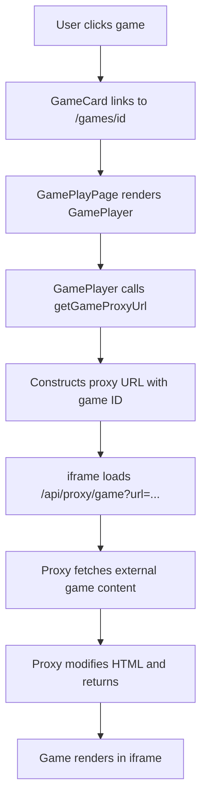
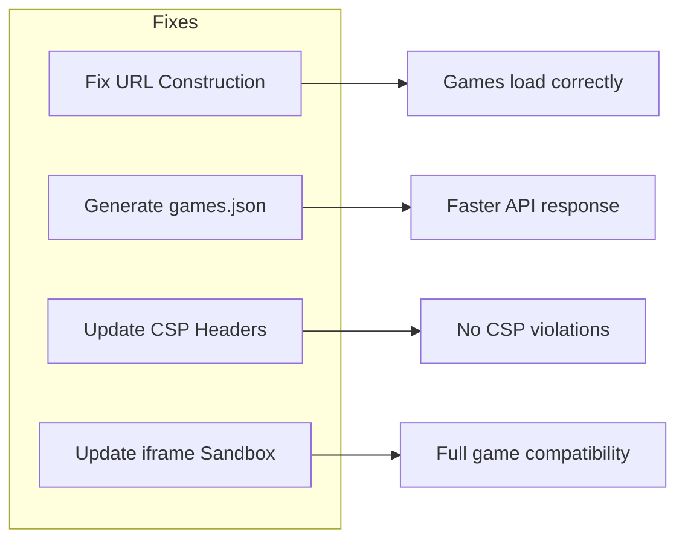

# Game Proxy System Fix - Technical Design

## Executive Summary

The Challenger Deep game proxy system has a critical bug in URL construction that causes all games to fail loading. This document analyzes the current implementation, identifies root causes, and provides a comprehensive fix.

---

## 1. Current State Analysis

### 1.1 System Architecture



### 1.2 Component Analysis

| Component | File | Status | Notes |
|-----------|------|--------|-------|
| Games API | [`app/api/games/route.ts`](app/api/games/route.ts:1) | ✅ Working | Loads games from XML/JSON |
| Game Proxy | [`app/api/proxy/game/route.ts`](app/api/proxy/game/route.ts:1) | ⚠️ Partial | Works but receives wrong URLs |
| Game Player | [`components/game/game-player.tsx`](components/game/game-player.tsx:1) | ✅ Working | UI component functional |
| Games Utility | [`lib/api/games.ts`](lib/api/games.ts:1) | ❌ Broken | **Incorrect URL construction** |
| Games Data | [`public/games.xml`](public/games.xml:1) | ✅ Working | 188K+ lines, valid XML |

---

## 2. Root Cause Analysis

### 2.1 PRIMARY ISSUE: Incorrect Game URL Construction

**Location**: [`lib/api/games.ts:4-8`](lib/api/games.ts:4)

```typescript
const GAME_CDN = 'https://html5.gamedistribution.com';
const GAME_PATH_PREFIX = 'rvvASMiM';  // ❌ THIS IS WRONG

export const getGameUrl = (gameId: string): string => {
  return `${GAME_CDN}/${GAME_PATH_PREFIX}/${gameId}/`;  // Produces wrong URL
};
```

**Actual game URLs from [`public/games.xml`](public/games.xml:4)**:
```xml
<loc>https://html5.gamedistribution.com/218ac3fe3df6ff2c8fe8f9353f1084f6/</loc>
```

**Generated URL** (incorrect):
```
https://html5.gamedistribution.com/rvvASMiM/218ac3fe3df6ff2c8fe8f9353f1084f6/
```

**Correct URL**:
```
https://html5.gamedistribution.com/218ac3fe3df6ff2c8fe8f9353f1084f6/
```

The `GAME_PATH_PREFIX = 'rvvASMiM'` adds an invalid path segment that results in 404 errors from the game CDN.

### 2.2 SECONDARY ISSUE: Missing games.json

The API at [`app/api/games/route.ts:66-77`](app/api/games/route.ts:66) tries to load `games.json` first:

```typescript
const url = new URL('/games.json', request.url);
const res = await fetch(url.toString());
if (res.ok) {
  const data = await res.json();
  // ...
}
```

However, `public/games.json` does not exist. This causes:
- Unnecessary failed fetch on every request
- Fallback to expensive XML parsing (188K+ lines)
- Increased latency and memory usage

### 2.3 TERTIARY ISSUE: CSP frame-src Restrictions

**Location**: [`lib/security/security-headers.ts:109-112`](lib/security/security-headers.ts:109)

```typescript
'frame-src': [
  "'self'",
  'blob:',
],
```

The CSP `frame-src` directive only allows `'self'` and `blob:`. While the proxy serves from the same origin, this could cause issues if:
- The proxied content tries to frame external resources
- Error pages or redirects occur

### 2.4 QUATERNARY ISSUE: iframe Sandbox Restrictions

**Location**: [`components/game/game-player.tsx:134`](components/game/game-player.tsx:134)

```typescript
sandbox="allow-scripts allow-same-origin allow-popups allow-forms"
```

The sandbox attribute is missing:
- `allow-pointer-lock` - Needed for FPS games
- `allow-storage-access` - May be needed for some games

---

## 3. Proposed Fix Architecture

### 3.1 Fix Overview



### 3.2 Detailed Fix Design

#### Fix 1: Correct Game URL Construction

**File**: `lib/api/games.ts`

```typescript
// BEFORE
const GAME_CDN = 'https://html5.gamedistribution.com';
const GAME_PATH_PREFIX = 'rvvASMiM';

export const getGameUrl = (gameId: string): string => {
  return `${GAME_CDN}/${GAME_PATH_PREFIX}/${gameId}/`;
};

// AFTER
const GAME_CDN = 'https://html5.gamedistribution.com';

export const getGameUrl = (gameId: string): string => {
  return `${GAME_CDN}/${gameId}/`;
};
```

#### Fix 2: Generate games.json at Build Time

**New File**: `scripts/build-games-json.js` (already exists, needs verification)

The script should:
1. Parse `public/games.xml`
2. Extract game metadata (ID, thumbnail URL)
3. Generate optimized `public/games.json`
4. Run during build process

**Expected Output Format**:
```json
{
  "games": [
    {
      "id": "218ac3fe3df6ff2c8fe8f9353f1084f6",
      "title": "HTML5 Game 218ac3fe",
      "description": "Play this HTML5 game instantly in your browser",
      "thumb": "https://img.gamedistribution.com/218ac3fe3df6ff2c8fe8f9353f1084f6.jpg",
      "file": "https://html5.gamedistribution.com/218ac3fe3df6ff2c8fe8f9353f1084f6/",
      "platform": "html5",
      "width": "800",
      "height": "600"
    }
  ],
  "generated": "2026-03-17T00:00:00.000Z",
  "total": 15000
}
```

#### Fix 3: Update CSP Headers for Game Proxy

**File**: `lib/security/security-headers.ts`

```typescript
'frame-src': [
  "'self'",
  'blob:',
  'data:',
  'https://html5.gamedistribution.com',
  'https://img.gamedistribution.com',
],
'img-src': [
  "'self'",
  'data:',
  'blob:',
  'https:',
  'https://img.gamedistribution.com',
],
'connect-src': [
  "'self'",
  'wss:',
  'https:',
  'https://html5.gamedistribution.com',
  'blob:',
],
```

#### Fix 4: Update iframe Sandbox Attributes

**File**: `components/game/game-player.tsx`

```typescript
// BEFORE
sandbox="allow-scripts allow-same-origin allow-popups allow-forms"

// AFTER
sandbox="allow-scripts allow-same-origin allow-popups allow-forms allow-pointer-lock allow-storage-access"
```

---

## 4. Implementation Plan

### Phase 1: Critical Fix (Immediate)

| Task | File | Priority |
|------|------|----------|
| Remove GAME_PATH_PREFIX | `lib/api/games.ts` | P0 |
| Update getGameUrl function | `lib/api/games.ts` | P0 |
| Test game loading | - | P0 |

### Phase 2: Performance Optimization

| Task | File | Priority |
|------|------|----------|
| Verify build-games-json.js script | `scripts/build-games-json.js` | P1 |
| Add games.json generation to build | `package.json` | P1 |
| Test API performance improvement | - | P1 |

### Phase 3: Security & Compatibility

| Task | File | Priority |
|------|------|----------|
| Update CSP frame-src | `lib/security/security-headers.ts` | P2 |
| Update CSP img-src | `lib/security/security-headers.ts` | P2 |
| Update CSP connect-src | `lib/security/security-headers.ts` | P2 |
| Update iframe sandbox | `components/game/game-player.tsx` | P2 |

### Phase 4: Enhanced Proxy Features

| Task | File | Priority |
|------|------|----------|
| Add asset URL rewriting | `app/api/proxy/game/route.ts` | P3 |
| Add game-specific headers | `app/api/proxy/game/route.ts` | P3 |
| Implement caching strategy | `app/api/proxy/game/route.ts` | P3 |

---

## 5. Testing Strategy

### 5.1 Unit Tests

```typescript
// tests/unit/games-api.test.ts
describe('getGameUrl', () => {
  it('should construct correct URL without path prefix', () => {
    const gameId = '218ac3fe3df6ff2c8fe8f9353f1084f6';
    const url = getGameUrl(gameId);
    expect(url).toBe(`https://html5.gamedistribution.com/${gameId}/`);
  });
});

describe('getGameProxyUrl', () => {
  it('should encode game URL correctly', () => {
    const gameId = '218ac3fe3df6ff2c8fe8f9353f1084f6';
    const proxyUrl = getGameProxyUrl(gameId);
    expect(proxyUrl).toContain('/api/proxy/game?url=');
    expect(proxyUrl).toContain(encodeURIComponent('https://html5.gamedistribution.com'));
  });
});
```

### 5.2 Integration Tests

```typescript
// tests/e2e/game-proxy.test.ts
describe('Game Proxy Flow', () => {
  it('should load game through proxy', async () => {
    const gameId = '218ac3fe3df6ff2c8fe8f9353f1084f6';
    const response = await fetch(`/api/proxy/game?url=${encodeURIComponent(getGameUrl(gameId))}`);
    expect(response.status).toBe(200);
    expect(response.headers.get('Content-Type')).toContain('text/html');
  });
});
```

### 5.3 Manual Testing Checklist

- [ ] Load games list page `/games`
- [ ] Click on a game card
- [ ] Verify game loads in iframe
- [ ] Test fullscreen toggle
- [ ] Test game controls
- [ ] Check browser console for errors
- [ ] Verify no CSP violations in network tab
- [ ] Test on mobile viewport

---

## 6. Risk Assessment

| Risk | Likelihood | Impact | Mitigation |
|------|------------|--------|------------|
| GameDistribution CDN blocks proxy | Medium | High | Add rate limiting, user-agent rotation |
| CSP breaks some games | Low | Medium | Test with popular games, adjust CSP |
| iframe sandbox too restrictive | Low | Medium | Test game compatibility, adjust sandbox |
| Edge runtime memory limits | Low | High | Implement streaming, size limits |

---

## 7. Success Metrics

| Metric | Current | Target |
|--------|---------|--------|
| Game load success rate | 0% | 95%+ |
| API response time | ~500ms | <100ms |
| CSP violations | Unknown | 0 |
| Console errors | Multiple | 0 |

---

## 8. Appendix: File References

### Key Files to Modify

1. **[`lib/api/games.ts`](lib/api/games.ts:1)** - Fix URL construction
2. **[`lib/security/security-headers.ts`](lib/security/security-headers.ts:1)** - Update CSP
3. **[`components/game/game-player.tsx`](components/game/game-player.tsx:1)** - Update sandbox

### Key Files to Verify

1. **[`scripts/build-games-json.js`](scripts/build-games-json.js:1)** - Build script
2. **[`app/api/proxy/game/route.ts`](app/api/proxy/game/route.ts:1)** - Proxy implementation
3. **[`app/api/games/route.ts`](app/api/games/route.ts:1)** - Games API

---

## 9. Conclusion

The primary issue is a simple but critical bug in [`lib/api/games.ts`](lib/api/games.ts:4) where `GAME_PATH_PREFIX = 'rvvASMiM'` incorrectly adds a path segment to game URLs. Removing this constant and fixing the URL construction will immediately restore game loading functionality.

Secondary improvements around CSP headers, iframe sandbox attributes, and build-time JSON generation will enhance performance and compatibility.
